INTRODUCCIÓN AL MANEJO DE DATOS Y PROGRAMACIÓN EN R
========================================================
width: 1366
height: 768
font-family: 'Serif'
author: Gustavo A. Ballen

Museu de Zoologia da Universidade de São Paulo

gaballench@gmail.com

========================================================
# SCRIPTS INFORMÁTICOS Y CÓMO OBTENER AYUDA SOBRE R

========================================================
# SCRIPTS INFORMÁTICOS

Por qué son importantes los scripts?
========================================================

* Los scripts informáticos son un conjunto de instrucciones para que la computadora realice las tareas que deseamos
* Sería muy aburrido tener que reescribir todas las instrucciones cada vez que quisieramos ordenarle a la computadora realizar esas tareas
* Son una manera de compartir tal conocimiento con la comunidad científica
* El estilo de programación muhas veces cambia conforme pasa el tiempo. Los scripts nos permiten aprender de la forma en que este evoluciona
* Estos contenidos son guardados en un archivo de texto plano para permitir la mayor compatibilidad posible

Estructura de un script sencillo de R
========================================================


```r
# Inicio del archivo de texto
library(ggplot2)
library(gridExtra)

setwd("Analyses")
source("measurements.R")

png(filename = "Figure 4.png", width = 480 , height = 480, unit = "px", 
    bg = "white")
headEyeQplot <- qplot(x = Species, y = Head.eye.L., data =corrected, geom = "boxplot", 
                      main = "Head measurements", xlab = "Species", ylab = "Head-Eye L.")

headPecQplot <- qplot(x = Species, y = Head.pectoral.L., data =corrected, geom = "boxplot", 
                      xlab = "Species", ylab = "Head-Pectoral D.")
grid.arrange(headEyeQplot, headPecQplot, ncol = 1)
dev.off()
# Fin del archivo de texto
```

Cómo comenzamos a escribir un script?
========================================================

* Podemos usar los IDEs que soportan R para tal actividad, pues ofrecen herramientas útiles de edición de texto de programación
* Vamos escribiendo las líneas de código que nos van funcionando para realizar las tareas necesarias, de tal modo que al final tenemos la versión que sí funcionó de todos los intentos que hicimos
* Guardamos este archivo con extensión .R

Escribiendo un script en un IDE
========================================================

<center>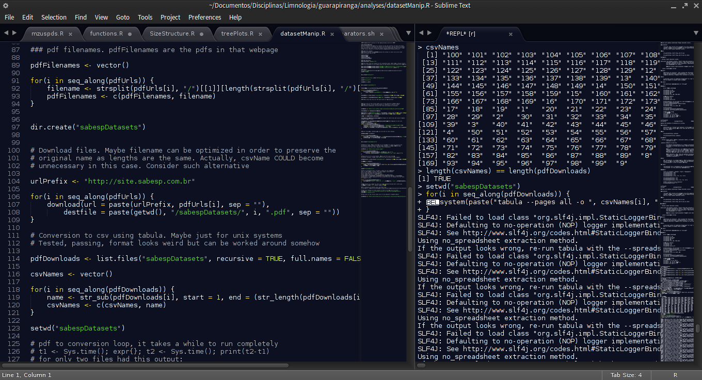</center>

Buenas prácticas al escribir scripts
========================================================

* Existen por lo menos dos guías de estilo para scripts en R
* Guía de estilo de Google Code para R, disponible [aquí](https://google-styleguide.googlecode.com/svn/trunk/Rguide.xml)
* Guía de estilo de Hadlwy Wickham, disponible [aquí](http://adv-r.had.co.nz/Style.html)
* Estas normas tienen ejemplos de buenas y malas prácticas. No entraremos en detalles de por qué son de un modo u otro, pues el usuario irá descubriendo por sí mismo el por qué de estas

Cómo definitivamente NO escribir o guardar un script
========================================================

* En un archivo de MS Word o LibreOffice Writer
* En una hoja de cálculo de MS Excel o LibreOffice Calc
* Guardado como una captura de pantalla en archivo gráfico
* Como imagen de la sesión de R .RData oi .Rhistory

Por qué no guardar scripts de este modo?
========================================================

* Archivos de texto enrriquecido provenientes de Word, Writer u otros editores de texto comunes incluyen texto de formato en dichos archivos
* Muchos problemas de compatibilidad
* Archivos fáciles de corromper
* Los archivos gráficos no son posibles de copiar, pegar y editar, de modo que no son nada útiles
* Los archivos .RData pueden incluir no solo el script sino objetos guardados dentro de la sesión, para evitar errores inadvertidos es mejor solo guardar el texto del script para reproducir los objetos al correrlo de ser necesario
* Los archivos .Rhistory guardan absolutamente todos los comandos enviados a la consola,. sean estos intentos erróneos o exitosos. Un archivo de estos va mucho trabajo para ser limpiado posteriormente

Rhistory
========================================================


```r
...
## for loop
for(i in seq_along(ordered)) {
subset <- cbind(subset, dataset[, ordered[3]])
count <- length(which(rowSums(subset) == 1))
uniqueVector <- c(uniqueVector, count)
}
uniqueVector
...
meansVector <- vector("numeric")
uniqueVector <- vector("numeric")
## for loop
for(i in seq_along(ordered)) {
subset <- cbind(subset, dataset[, ordered[i]])
count <- length(which(rowSums(subset) == 1))
uniqueVector <- c(uniqueVector, count)
}
...
```

Consejos: Identación
========================================================

* Usar identación para dar mejor claridad a la relación entre las líneas de una estructura compleja


```r
# Código sin identación
repeat {
if(s <= control) {
print(s)
s <- s + 1
} else {
break
}
}
```

***


```r
|# Código con identación
repeat {
        if(s <= control) {
                print(s)
                s <- s + 1
        } else {
                break
        }
}
```

Consejos: Nombres de objetos
========================================================

* Intentar no llamar objetos con palabras "reservadas" o de funciones populares pues pueden haber ambiguedad sobre el objeto al cual se hace referencia
* Por ejemplo, no llamar objetos `mean`, `sd`, `aov`, `var`, `function` pues estas corresponden a funciones muy utilizadas en R
* Usar nombres informativos para saber qué contienen determinados objetos
* Tratar de utilizar nombres de objeto cortos para mayor eficiencia

========================================================
# AYUDA!!!

Por qué es importante obtener ayuda?
========================================================

* Cualquier herramienta informática requiere de un trabajo extensivo de documentación para los usuarios, y R tiene una documentación INMENSA!
* La mayoría de la documentación proviene de la comunidad de usuarios misma, lo cual es común en proyectos de software libre (+1 para el software libre)
* Como toda herramienta de programación o análisis basado en comandos, la probabilidad de obtener errores por algún caracter faltante (e.g., una coma) es alta
* Durante la primera etapa de aprendizaje del lenguaje es muy común cometer errores de toda índole, desde errores tipográficos hasta errores de comprensión de estructura de objetos

Qué opciones tenemos cuando necesitamos ayuda?
========================================================

* Entre los materiales disponibles encontramos manuales, libros, tutoriales en video y texto, cursos gratis, cursos pagos, foros, faqs, y un inmenso etcétera
* Un aspecto importante es saber qué tan compĺicado es el problema que estamos teniendo para así elegir la fuente de ayuda más apropiada
* Es muy importante no solo saber dónde encontrar ayuda, sino cómo pedirla

Documentación básica: CRAN
========================================================

* Como ya vimos, disponible en http://cran.r-project.org/
* Aparte de ser el repositorio oficial del proyecto R, contiene una extensa lista de recursos de aprendizaje y la documentación oficial de R

<center>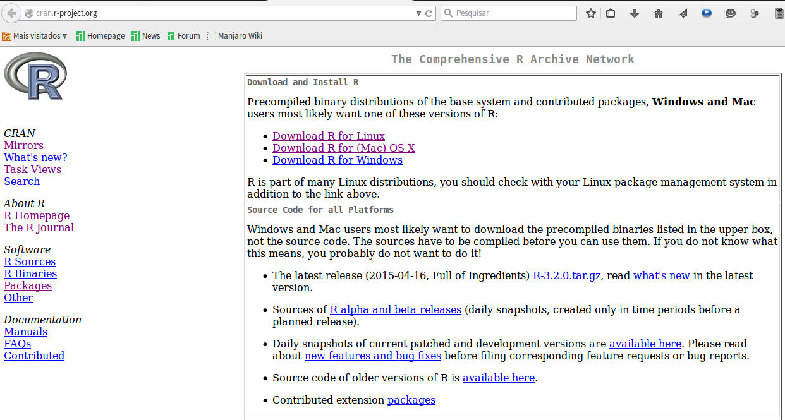</center>

Documentación básica: CRAN (Manuales)
========================================================

<center>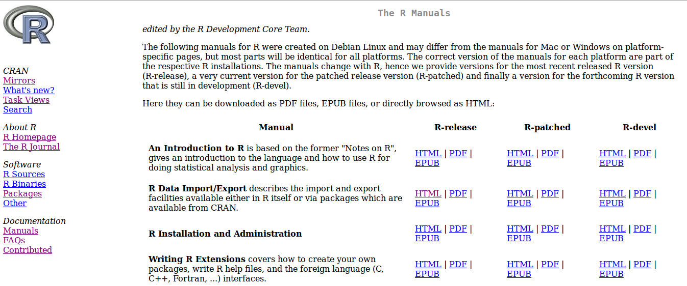</center>

Documentación básica: CRAN (FAQS [frequently-asked questions])
========================================================

<center>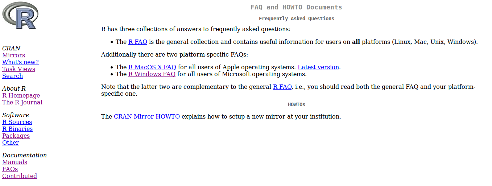</center>


Documentación básica: CRAN (Materiales contribuidos)
========================================================

<center>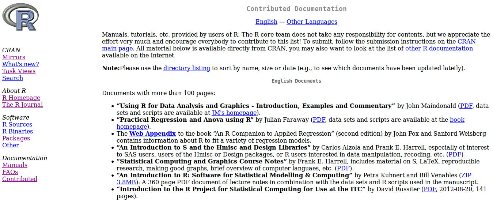</center>

R-project: Listas de correo
========================================================

* http://www.r-project.org/mail.html
* A estas listas de correo se pueden enviar preguntas y/o respuestas sobre R. Hay diferentes listas temáticas donde las preguntas se concentran en R aplicado a campos especiales de análisis (e.g., R-SIG-ecology sobre R aplicado a ecología)

<center>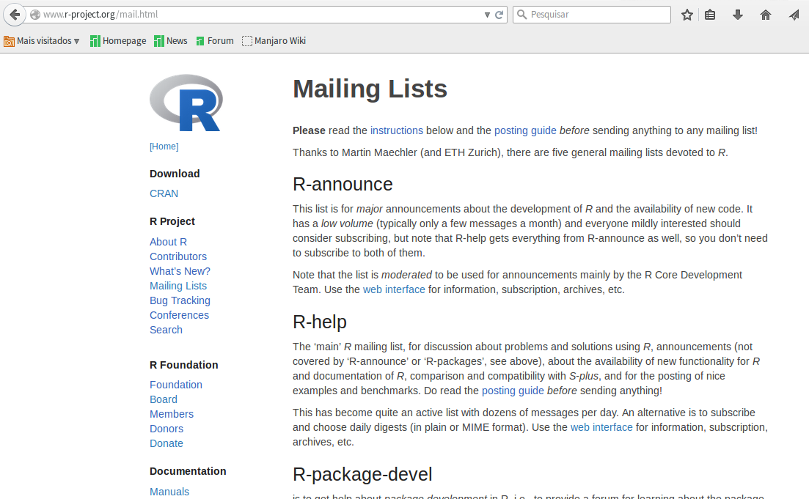</center>

StackOverflow.com
========================================================

* Portal social online para preguntas y respuestas relacionadas principalmente con tecnología, pero expandiéndose a otros temas tales como cultura y artes
* Podría pensarse en este como el "Yahoo respuestas" de la tecnología (incluyendo programación, lenguajes y muchos otros temas) pero sin la inmensa cantidad de preguntas cómicas que se encuentran en aquella página de yahoo.
* Presenta un cuidado serio de la comunidad, de modo que preguntas fuera de contexto o duplicadas son rápidamente marcadas y modificadas para mantener la limpieza del portal
* Disponible en http://stackoverflow.com

StackOverflow.com
========================================================

<center>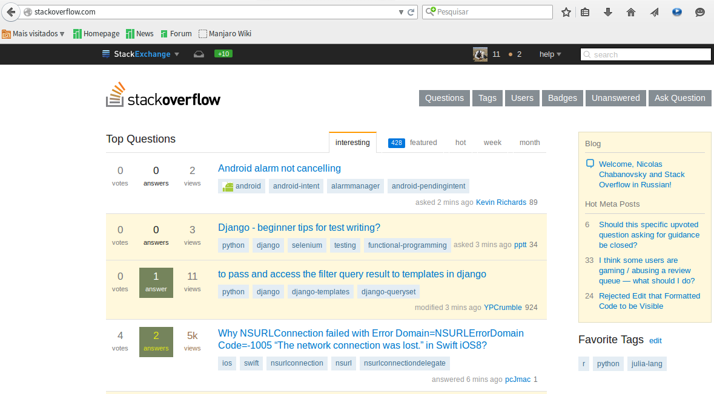</center>

StackOverlow.com: Cómo funciona?
========================================================

* Como algunos recursos online, tenemos que abrir una cuenta para realizar preguntas o enviar respuestas
* Si queremos solamente leer preguntas y respuestas hechas por otras personas, podemos tener acceso a estas sin necesidad de tener una cuenta
* Realizamos una pregunta _de manera adecuada_ y asociando etiquetas a la misma, de tal forma que el portal sea capaz de organizar las preguntas en categorías y así permitir a la comunidad enfocarse en asuntos relacionados con una situación particular, ya sea un sistema operativo, leguaje de programación, tipo de análisis, etc.
* En la barra superior de la página encontramos un cuadro de texto para realizar búsquedas; antes de preguntar ___siempre___ buscar por palabras clave allí para estar seguros de que lo que vamos a preguntar no ha sido preguntado antes

StackOverlow.com: Estructura de preguntas
========================================================

<center>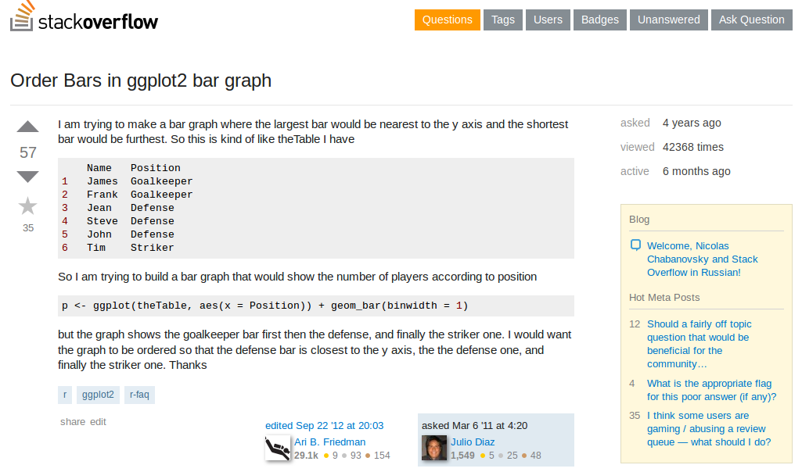</center>

StackOverlow.com: Estructura de respuestas
========================================================

<center>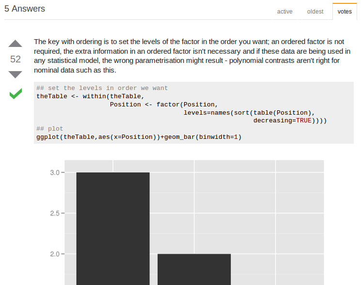</center>

StackOverlow.com: Estructura de respuestas
========================================================

<center>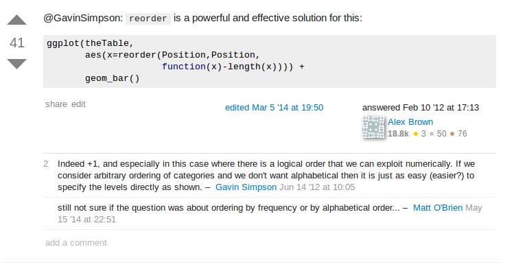</center>


R project en español (Facebook)
========================================================

<center></center>

R project en español
========================================================

<center>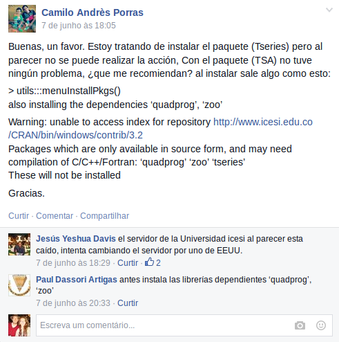</center>

Por último y la más importante... Google
========================================================

* La maravilla más grande de las tecnologías de la información en el S. XXI
* Ni la patineta voladora de Marty McFly es tan sensacional como google
* No existe libro, profesor, o tutorial que se le compare
* Disponible en https://www.google.com

Google.com
========================================================

<center></center>

Google.com
========================================================

<center>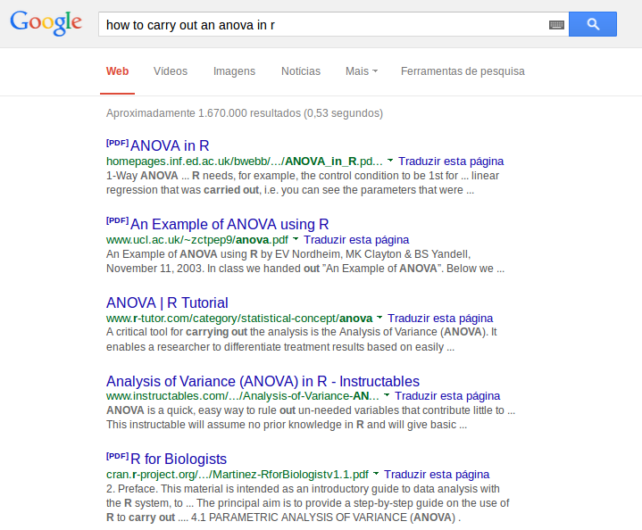</center>

Cómo hacer buenas preguntas?
========================================================

* El arte de preguntar es algo que parece obvio pero la experiencia indica que no lo es
* Consiste en un conjunto de reglas sencillas que mezclan un poco de asertividad, creatividad, y modales
* Hay diferentes listas de normas para enviar mensajes en foros y listas de correo, las cuales deberían por sentido común aplicar a otras situaciones como grupos de facebook, sin embargo, esto no sucede... ni siquiera en las listas de correo oficiales de R

Manuales para usar listas/foros
========================================================

* http://www.r-project.org/posting-guide.html
* http://stackoverflow.com/help/how-to-ask (y referencias en esa página)


"How to ask questions the smart way"
========================================================

* http://www.catb.org/~esr/faqs/smart-questions.html
* Un sumario del contenido es

        + Before You Ask
        + When You Ask
        + How To Interpret Answers
        + On Not Reacting Like A Loser
        + Questions Not To Ask
        + Good and Bad Questions
        + If You Can't Get An Answer
        + How To Answer Questions in a Helpful Way

Y dentro de R... Cómo obtener ayuda?
========================================================

* Las funciones `help()` y `example()` permiten abrir dos componentes importantes de la documentación de una función o paquete: El archivo de documentación como tal, y ejemplos de código haciendo uso de dichas funciones
* Los operadores `?` y `??` son abreviaturas de las funciones `help()` y `help.search()`, que permiten buscar tópicos tales como funciones o palabras clave sobre procedimientos de interés. La primera de estas funciones requiere que el objeto sobre el cual queremos buscar información tenga el nombre exacto de un objeto (e.g., una función o paquete). La segunda de estas funciones es útil para extender la búsqueda a páginas de ayuda sobre temas no tan específicos (por ejemplo temas o procedimientos, digamos, varianza, especies, etc.)

Ayuda en R
========================================================


```r
# Todos estos son métodos equivalentes
help(aov) # Debe ser un nombre de objeto o estar en el nombre del archivo de ayuda 
help("aov") # Puede usarse entre comillas
?aov # Versión simplificada de la misma función
?"aov" # También permite usar comillas para realizar búsqueda
```


```r
# Estos dos son métodos equivalentes. Note que no existe ningún objeto de R llamado "variance"
help.search("variance") # Puede ser un término no incluido en el título del archivo de ayuda. Debe encontrarse entre comillas
??"variance" # Versión simplificada de la misma función. Debe estar entre comillas
```

Cómo NO hacer preguntas
========================================================

<center></center>

<center></center>

<center></center>

========================================================

<center></center>

<center></center>

<center></center>

========================================================

<center>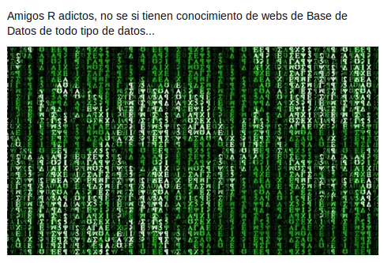</center>

========================================================

<center>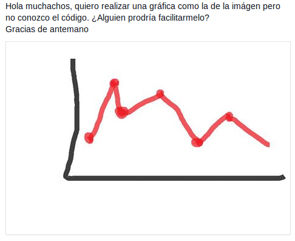</center>

Mala pregunta en lista de correos
========================================================

<center>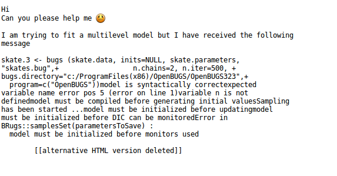</center>

Respuesta recibida en lista de correos
========================================================

<center>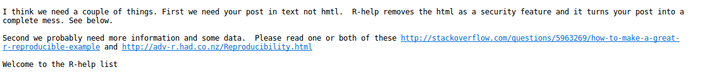</center>

Respuesta recibida en lista de correos
========================================================

<center>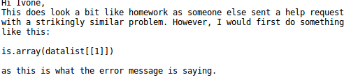</center>
