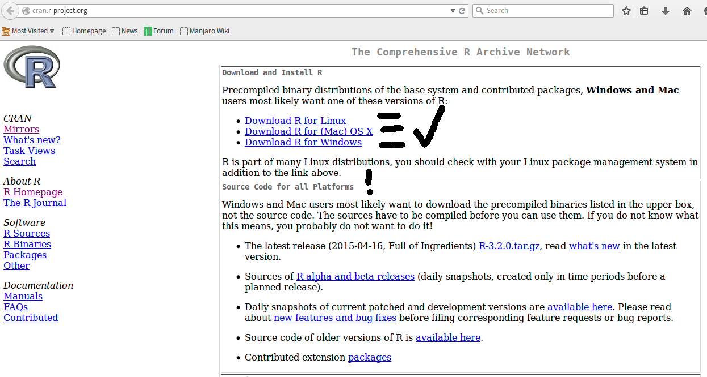
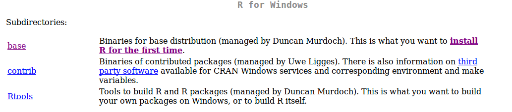
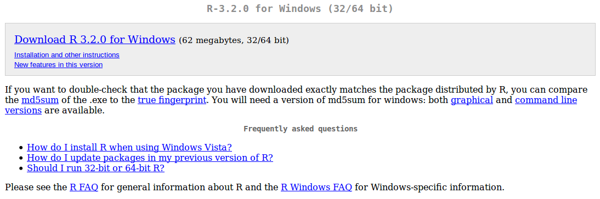
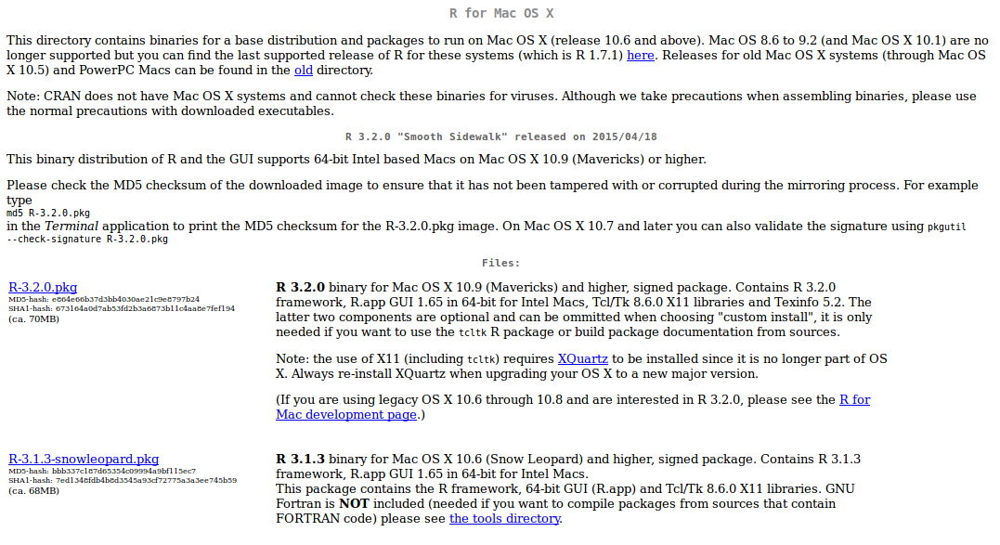
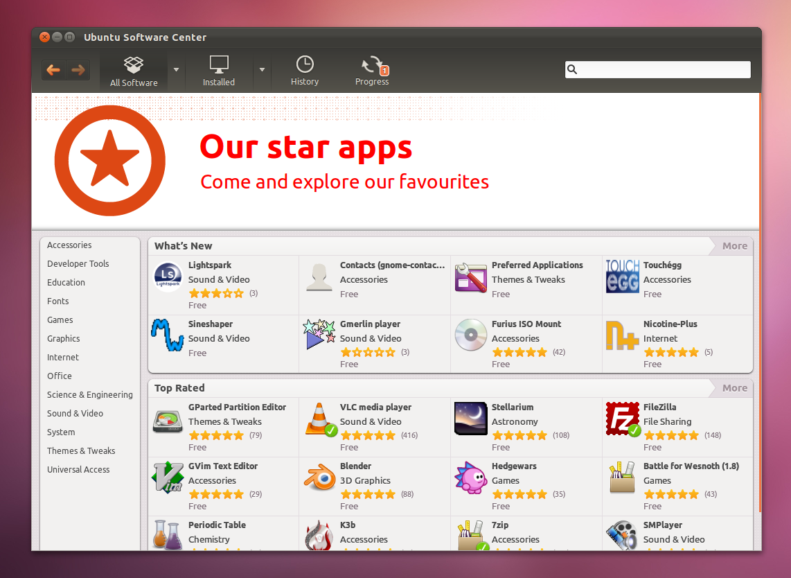
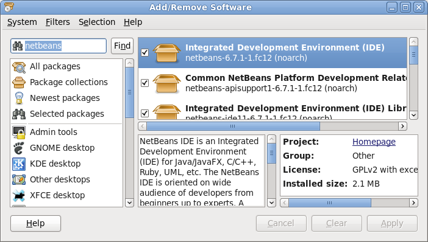
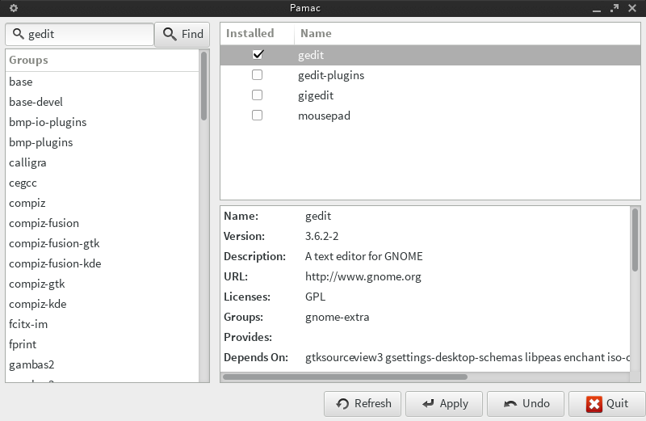

# Eligiendo el sistema operativo

El sistema operativo es el software que nos permite comunicarnos con la computadora, se encarga de manejar los archivos, y responde a nuestras solicitudes. En conclusión, es el software que maneja el hardware, es decir, la estructura física de la computadora. Esta elección sigue nuestra motivación e intereses para usar una computadora en primer lugar.

Si no queremos tener mucho control sobre lo que pasa tras bambalinas, es probable que queramos usar Windows u OSX, o para más control y tal vez exigencia (no siempre) una distribución Linux. En este último caso, algunas de las distribuciones más populares son Ubuntu, Fedora, Mint o Manjaro. Para todas ellas hay manera de instalar R, por lo que se le cosidera un programa multiplataforma (i.e., multi-sistema-operativo).

# ¿En qué sistemas operativos corre `R`?

* MS Windows
* Mac OSX
* Cualquier distribución popular de linux (e.g., Ubuntu, Fedora, Mandriva, Mint, Manjaro, Archlinux...)
* ¡Aún en un PlayStation3!


# ¿Qué necesito para usar `R`?

* Depende de la cantidad de datos a analizar y de la RAM y procesador disponibles
* Desde una computadora personal para arriba
* No hay una descripción de hardware mínima específica ofrecida por R project
* (opcional) conexión a la internet (al menos para instalar paquetes de manera fácil)


# Instalando R

[CRAN](http://cran.r-project.org/) es el repositorio oficial de software de R. Contiene desde los archivos de instalación básica hasta el código fuente usado para programarlo.



## R en Windows

Para instalar R en windows tenemos que visitar CRAN, dar click en [Download for Windows](http://cran.r-project.org/bin/windows/), dspués [install R for the first time](http://cran.r-project.org/bin/windows/base/) y después [Download R-version for windows](http://cran.r-project.org/bin/windows/base/R-3.2.0-win.exe). En vez de "version" veremos un número (en este momento 3.2.0) que corresponde con la última versión estable de R. Estos pasos nos llevarán a descargar un archivo ejecutable, el instalador de R. Al ejecutarlo abrirá un wizard que nos irá preguntando cosas sobre la instalación.




## R en OSX

Para instalar R en OSX debemos visitar CRAN, ir a la sección [Download R for (Mac) OS X](http://cran.r-project.org/bin/macosx/), y dar click en el archivo con extensión .pkg (en este caso [|R-version.pkg](http://cran.r-project.org/bin/macosx/R-3.2.0.pkg)). El siguiente [video](https://www.youtube.com/watch?v=ICGkG7Gg6j0) contiene el proceso completo.

Tal vez sea necesario instalar gfortran y tcltk, disponibles en el link [tools](http://cran.r-project.org/bin/macosx/tools) allí mismo en CRAN. Por qué es necesario instalar gfortran y tcltk? El primero es un compilador para código FORTRAN, un lenguaje de programacion en el que algunos de los paquetes de R están esritos. Si no contamos con dicho compilador, R será incapaz de instalar paquetes que contienen código FORTRAN.Tcl/Tk es necesario para hacer uso del paquete tcktl, que es necesario en algunos paquetes con interfaz gráfica, por ejemplo, RCommandery vegan.



## R en Linux: Linea de comandos y package managers

### Debian 
Ver instrucciones [aquí](http://cran.r-project.org/bin/linux/debian/). Puede ser necesario completar algunos pasos como incluir CRAN dentro de la lista de repositorios en `/etc/apt/sources.list`.

En ocasiones es necesario además agregar la clave apt (ver SECURE APT) en aquella página.

Cuando todo esté listo para obtener la versión más actualizada, basta usar `apt-get` en la línea de comandos

```
apt-get update
apt-get install r-base r-base-dev
```

### Ubuntu
Ver instrucciones [aquí](http://cran.r-project.org/bin/linux/ubuntu/). Dado que Ubuntu (y también Mint) son distribuciones basadas en Debian, el proceso es muy similar y tal vez sea necesario incluir CRAN dentro de la lista de repositorios para obtener las versiones más actualizadas de R conforme vayan saliendo.

En ocasiones es necesario además agregar la clave apt (ver SECURE APT) en aquella página.

Cuando todo esté listo para obtener la versión más actualizada, basta usar `apt-get` en la línea de comandos

```
sudo apt-get update
sudo apt-get install r-base
```

### openSUSE

Como super usuario (`su`) en la línea de comandos obtener la información de la versión instalada de openSUSE
```
VERSION=$(grep VERSION /etc/SuSE-release | sed -e 's/VERSION = //')
zypper addrepo -f \ 
http://download.opensuse.org/repositories/devel\:languages\:R\:patched/openSUSE_$VERSION/ \
R-patched
```
Posteriormente instalar R con
```
zypper install R-patched R-patched-devel
```
Para mantener R actualizado usar el siguiente comando
```
zypper install R-patched R-patched-devel
```

### Fedora

Estas instrucciones fueron obtenidas en el siguiente [link](http://forums.fedoraforum.org/showthread.php?t=254467). Puede ser necesario realizar estas acciones como super usuario.

```
yum list R # Esto nos brinda información sobre la versión de R disponible con yum
yum install R # Esta línea instala R
```

### Arch-based linux (Arch, Manjaro)

La versión más actualizada de R llega a los repositorios oficiales de Arch con relativa celeridad, por lo que bastará con usar pacman en la línea de comandos (como super usuario) para instalarlo

```
sudo pacman -S r
```

## Instalación usando los package managers

Generalmente `R` se llama `r` en estos repositorios, aunque en distribuciones basadas en debian (e.g., ubuntu y mint) se llama `r-base`, en openSUSE se llama `R-patched` y en Arch/Manjaro simplemente `r`. En el package manager de su sistema operativo puede buscar R como `r` o usar el nombre específico del repositorio de sus sistema (e.g., `r-base` en el caso de Ubuntu).

### Ubuntu: Ubuntu software center



### Fedora: Package manager



### Arch/Manjaro: Package manager (Pacman)



# Corriendo R

* Sistemas de interfaz gráfica: Doble click en el logo
* Linea de comandos: Depende del nombre (e.g., r-base, r, R, etc.), basta con escribirlo y dar enter. Usualmente r va a tener opciones para correr desde línea de comandos, lo cual se puede explorar escribiendo r --help. Si r tiene otro nombre en el sistema, por ejemplo r-devel, usar ese nombre en vez de r simple para el comandode ayuda.

# Ahora... Cómo empiezo?

Este curso no tiene prerrequisitos per se, pero dado que la meta es aprender las bases de programación y análisis de datos en R en dos días de curso precongreso, más nos vale ser ñoños y adelantar algo de trabajo. El siguiente link contiene un curso online gratuito que los estudiantes deberán completar antes de llegar a las sesiones de Leticia. No importa si parte del material no se entendió por completo, el hecho de realizarlo generará familiaridad con R, lo que agilizará el trabajo.

[Try R](http://tryr.codeschool.com/)

Una vez terminado ese cursillo introductorio y obtenido el último 'badge', tomar un pantallazo y enviarlo por correo electrónico a gaballench /arroba/ gmail /punto/ com.


# IDE para R: Rstudio y otras alternativas

Los IDEs (ambiente de desarrollo integrado por su siglas en inglés) son programas que hacen mas amena la programación en diferentes lenguajes, y con frecuencia presentan herramientas para optimizar procesos como debugging, revisión de sintaxis, predicción de texto y planillas. Estas herramientas son útiles pero no necesarias para programar.

R Presenta soporte en diferentes IDEs, incluyendo uno especializado en R. Algunos de los IDEs son supremamente básicos y solamente soportan formato de sintaxis en scripts pero no poermiten enviar a la consola los scripts. Algunos de estos IDEs que personalmente conozco y dónde obtenerlos se encuentran a continuación. Cabe resaltar que el recomendado es Rstudio, un IDE especializado en R que tiene soporte para diferentes funciones que otros no presentan.

Para el curso deben llegar con R y algún IDE que soporte trabajo interactivo con la consola de R (e.g., Rstudio, Tinn-R, vim, Sublime Text, etc.)

## Rstudio
Se encuentra en [http://www.rstudio.com/](http://www.rstudio.com/)

### Pros
* Gratis
* Funciones especiales para R como paneles con información de los objetos en memoria, ayuda  y visualización de objetos especiales como presentaciones
* Cada vez presenta funciones más útiles como verificación de sintaxis
* Presenta tal vez el mirror más eficiente actualmente (0-cloud)
* Comunicación limpia entre la consola y el panel de script (Crtl+Enter)

### Contras
* A veces no es necesario tener todo a la vista en los paneles. Sin embargo, esto puede saltarse minimizando dichos páneles.
* Solo soporta herramientas para R, markdown y C.

## Tinn-R
Se encuentra en este [link](http://nbcgib.uesc.br/lec/software/editores/tinn-r/en)

### Pros
* Muchas de las opciones de Rstudio
* la interfaz gráfica soporta muchas opciones para usuarios acostumbrados a la aproximación point-and-click

### Contras
* La cantidad de opciones de la interfaz gráfica es tan grande que puede resultar poco eficiente

## RGedit
Se encuentra en [sourceforge](http://rgedit.sourceforge.net/)

### Pros
* Multiplataforma
* Plugin para gedit, un editor de texto versatil y sencillo que soporta más opciones que notepad o wordpad (ambos en windows)
* Soporta uso por conexiones SSH y formato de código
* Especialmente útil para escribir scripts rápidos, simples, o que no requieren ser corrido en el momento

### Contras
* No tiene conexión a consola de R, por lo que los scripts no se pueden correr directamente desde gedit con el plugin rgedit

## Sublime text 3
Se encuentra en [Sublime Text](http://www.sublimetext.com/)

### Pros
* Es un editor de texto especial para programadores
* Tiene tantas opciones y soporte para tantos lenguajes de programación que sus posibilidades son increiblemente más extensas que cualquier otro IDE que soporte R
* Es más eficiente cuando se debe programar en varios lenguajes incluyendo R

### Contras
* No es gratis
* El output de la consola no tiene aún justificación de texto, por lo que en ocasiones toca moverse con la barra de desplazamiento horizontal para ver parte del output de R