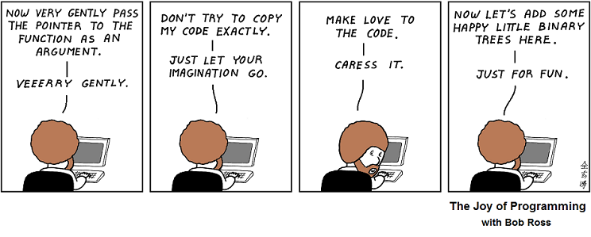
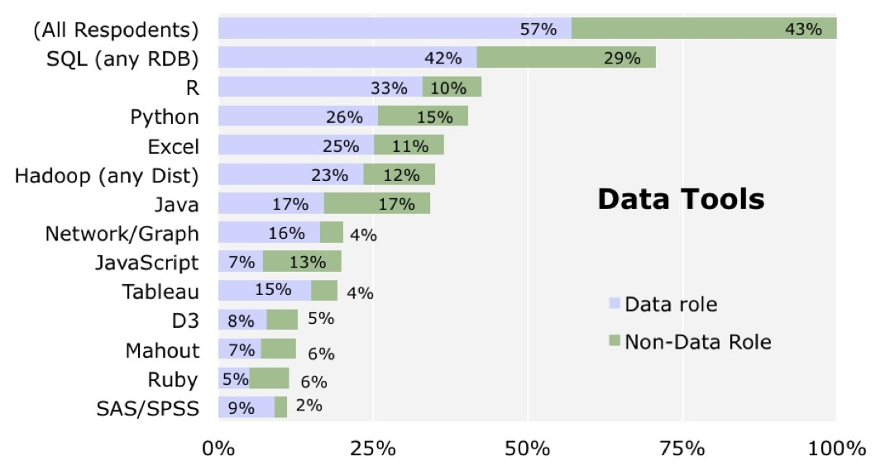
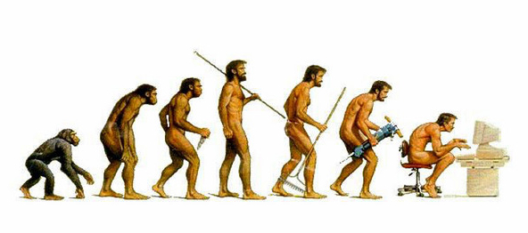
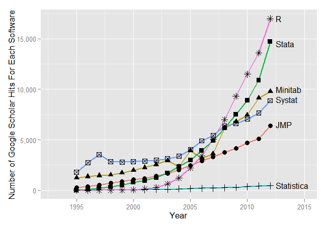
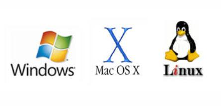
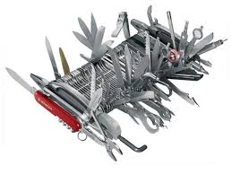
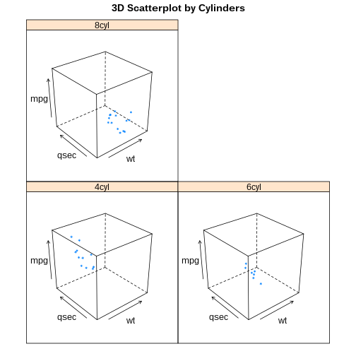
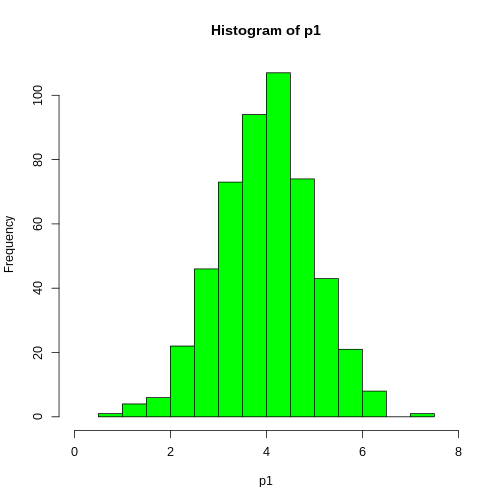
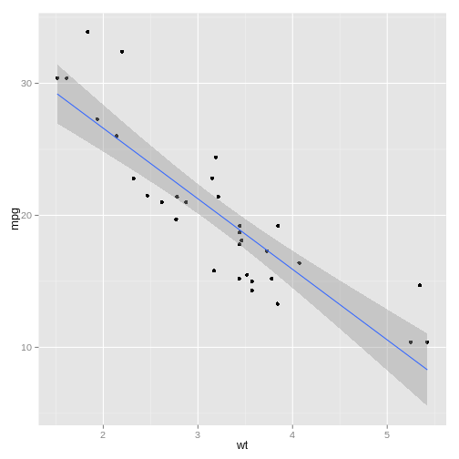
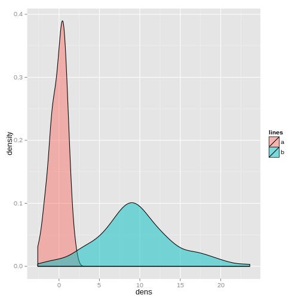

INTRODUCCIÓN AL MANEJO DE DATOS Y PROGRAMACIÓN EN R
========================================================
font-family: 'Serif'
author: Gustavo A. Ballen
Museu de Zoologia da Universidade de São Paulo
gaballench@gmail.com


========================================================

# INTRODUCCIÓN A R: BREVE HISTORIA Y CONTEXTO

Acerca de programación/R
========================================================

* "La mayoría de los buenos programadores programan no porque esperan pago por ello o para ser adulados por el público, sino porque es divertido programar." -Linus Torvalds
* "Programar es como conducir un auto, cuando no se sabe lo que se hace, no anda." 
* "Usar `R` sin aprender su gramática es como tratar de identificar carácidos; si no se sabe lo básico, solo vemos una mezcla de cosas desorganizadas con la cual no sabemos por dónde empezar."

Programación según Bob Ross
=======================================================



La importancia de `R`/ciencia de datos en la vida laboral
=======================================================

Diferentes herramientas informáticas requeridas por empleadores (Fuente: O'Really Strata Survey)

<center></center>

Historia y contexto
=======================================================

* `S` aparece en el año 1988 desarrollado por John Chambers et al. en Bell Labs
* `R` aparece como una versión de libre acceso en el año 1993
* En el año 2001 se encuentran 110 paquetes desarrollados por la comunidad disponibles en CRAN

Historia y contexto
=======================================================



¿Qué es `R`?
=======================================================


¿Qué es `R`?
=======================================================

* Un programa para análisis estadísticos
* Un dialecto de programación
* Una herramienta graficadora
* Una calculadora de escritorio
* Una herramienta de SIG
* Una herramienta de simulación

`R` en comparación con otras herramientas de análisis de datos
=======================================================



`R` en comparación con otras herramientas de análisis de datos
=======================================================


Ventajas de `R`
=======================================================

* Libre acceso
* Corre en cualquier sistema operativo popular
* 6337 paquetes en CRAN (18 de febrero de 2015) y contando...
* Supremamente flexible
* Dialecto de programación
* Enfocado en el análisis estadístico
* Aparte de estadística, tiene un sinnúmero de aplicaciones
* Potente generador de sumarios y gráficas
* Permite la investigación reproducible

Desventajas de `R`
=======================================================

* Curva de aprendizaje relativamente suave
* Todos los objetos deben estar cargados en la memoria RAM
* Temor generalizado al código y a la programación
* Generar gráficas impresionantes requiere experticia
* ¿Realmente soy un usuario que necesita o está interesado en aprender a programar?
* No me despierta en la mañana
* No me prepara el café
* No identifica mis peces o mis fósiles (pero ayuda en ello)

¿En qué sistemas operativos corre `R`?
=======================================================

* MS Windows
* Mac OSX
* Cualquier distribución popular de linux (e.g., Ubuntu, Fedora, Mandriva, Mint, Manjaro, Archlinux...)
* ¡Aún en un PlayStation3!



¿Qué necesito para usar `R`?
=======================================================

* Depende de la cantidad de datos a analizar y de la RAM y procesador disponibles
* Desde una computadora personal para arriba
* No hay una descripción de hardware mínima específica ofrecida por R project
* (opcional) conexión a la internet (al menos para instalar paquetes de manera fácil)

=======================================================
# VARIABLES, OPERADORES, FUNCIONES Y ASIGNACIÓN

Objetos básicos
=======================================================

* Los objetos básicos son vectores, matrices, data frames, arrays, listas y funciones
* Objetos secundarios (o dependientes de funciones) en general son listas con metadatos
* Todo objeto es considerado una variable, pues puede contener "cualquier" valor definido por el usuario

Vectores: Generalidades
=======================================================

* Son arreglos unidimensionales, análogos a los vectores matemáticos. 
* Pueden contener diferentes clases de valores, pero solo una por vector (e.g., todos `character`)
* Pueden concatenarse en vectores multidimensionales (e.g., un data frame es una colección de vectores)

***


```
[1] 5
```

```
[1] 3.141593
```

```
[1] "a" "b" "c" "d"
```

```
[1] 4+0i
```

```
[1]  TRUE FALSE FALSE  TRUE
```

```
[1] "4"          "0.1"        "TRUE"       "Characidae"
```

Matrices: Generalidades
=======================================================

* Son arreglos bidimensionales
* Deben contener objetos de __la misma__ clase
* Sus dimensiones son líneas * columnas

***


```
     [,1] [,2] [,3]
[1,]    1    4    7
[2,]    2    5    8
[3,]    3    6    9
```

Data frames: Generalidades
=======================================================

* Al igual que las matrices, son arreglos bidimensionales
* Pueden contener columnas con objetos de diferentes clases
* Sus dimensiones son líneas * columnas, las columnas usualmente son las variables. Es sobre las columnas que operan las diferencias de clase

***


```
  var1 var2  var3   var4
1    4    a  TRUE -0.690
2    4    b FALSE -0.274
3    4    c FALSE -0.724
4    4    d  TRUE -1.959
5    4    e FALSE  0.126
```

Listas: Generalidades
=======================================================

* Son colecciones de objetos
* Sus componentes pueden ser de cualquier clase
* Sus componentes puede tener cualquier cantidad de dimensiones

***


```
[[1]]
[1] 5

[[2]]
[1] "a" "b" "c" "d"

[[3]]
     [,1] [,2] [,3]
[1,]    1    4    7
[2,]    2    5    8
[3,]    3    6    9
```

Operadores
=======================================================

* Modifican valores de un objeto
* Agregan valores a un objeto
* Asignan valores a un objeto
* Aritméticos
     + `+`, `-`, `*`, `/`, `^` ó `**` (exponente), `%%` (modulus), `%/%` (división entera)
* Lógicos
     + `<`, `<=`, `>`, `>=`, `==`, `!=`, `!x` (no x), `x|y`(x Ó y), `x&y` (x Y y), `isTRUE(x)` (¿es X verdadero?)
* Asignación
     + `<-` (recomendado), `=` (NO recomendado)

Operadores de asignación
=======================================================

Uso de los operadores de asignación y funciones útiles para generar datos

*  `<-` asigna un valor (o valores) a una variable global (u objeto) (e.g., `variable1  <- valor`). SIEMPRE PARA VALORES!
* `=` asigna un valor (o valores) a una variable local (e.g., argumento x de una función es igual a `TRUE`; más sobre esto después). NUNCA PARA VALORES!
* c() junta los valores separados entre sí por comas (e.g., `c(elemento1, elemento2, elemento3, ...,  elementoN)`)
* `:` genera series de números enteros (e.g., `primer:último`; 1:10 son los enteros del 1 al 10)

Funciones: Generalidades
=======================================================

* Son instrucciones automatizadas que realizan tareas específicas
* Pueden operar sobre objetos, pero no es obligatorio  (e.g., `dir()`)
* Contienen opciones llamadas argumentos
* Sucedidos por paréntesis (e.g., `c()`, `nrow()`, `sd()`, `lm()`)

***


```r
rnorm(3)
```

```
[1] -0.7704495 -1.3392520 -0.1159626
```

```r
rep("GAB", 5)
```

```
[1] "GAB" "GAB" "GAB" "GAB" "GAB"
```

Asignando nuestros primeros valores a una variable
=======================================================

* Usar el operador `<-` para asignar el valor `2015` a la variable `x` y la función `c()` para asignar las vocales a la variable `vocales`


```r
x <- 2015
x
```

```
[1] 2015
```

```r
vocales <- c("a", "e", "i", "o", "u")
vocales
```

```
[1] "a" "e" "i" "o" "u"
```

Modificando los valores de un vector: c()
=======================================================

* `c()` `c`oncatena valores a un vector
* `c(vector, valores_a_agregar)`

```r
A <- 45
A <- c(A, 23)
A
```

```
[1] 45 23
```

Modificando los valores de un arreglo: cbind
=======================================================

Modificando los valores de un arreglo: rbind
=======================================================

Limpiando el espacio de trabajo: rm()
=======================================================


* rm()


```r
rm(A)
```

Qué tenemos en el espacio de trabajo?: ls()
=======================================================

* ls()

```r
ls()
```

```
 [1] "df"          "diffClasses" "matrix"      "myChar"      "myComplex"  
 [6] "myInteger"   "myList"      "myLogical"   "myNumeric"   "vocales"    
[11] "x"          
```

Muestreo aleatorio
=======================================================

* sample()


```r
sample(vocales, 3)
```

```
[1] "u" "a" "e"
```


* which()


```r
which(vocales =="e")
```

```
[1] 2
```

Algunas funciones de uso frecuente
=======================================================

* class()


```r
class(df)
```

```
[1] "data.frame"
```

* length()


```r
length(myList)
```

```
[1] 3
```


=======================================================
# PAQUETERÍA Y POTENCIAL GRÁFICO

¿Qué son los paquetes?
=======================================================

* Software (i.e., funciones) escritas para llevar a cabo tareas relacionadas
* TODOS de libre acceso
* La mayoría escritos en R, pero varios en C, C++ o FORTRAN
* Nivel pro en R. Si se ha aprendido a programar y se han generado funciones útiles para alguna tarea que valga la pena publicar, tal vez sea buena idea someter un nuevo paquete. La inmensa mayoría de los usuarios jamás llega a este punto

¿Qué son los paquetes?
=======================================================

* R + 4 paquetes

* R + 6 paquetes


***

R + 12 paquetes

* R + montones de paquetes


¿Dónde se encuentran?
=======================================================

* En el "Comprehensive R Archive Network", el repositorio oficial de R (http://cran.r-project.org/)
* R ha evolucionado de manera increíble en cuanto a soporte adicional de paquetería.


Ejemplos de paquetes
=======================================================

* `ggplot2`. Sistema avanzado de graficación
* `vegan`. Paquete para análisis ecológicos
* `ddplyr`. Paquete de herramientas para manipulación de datos
* `xlsx`. Paquete para importar/exportar datos entre R y MS Excel

Instalación
=======================================================

* install.packages()


```r
install.packages("vegan") #El nombre del paquete va entre comillas
```

Cargando paquetes
=======================================================

* library()


```r
library(vegan) #Al cargar el paquete NO usar comillas
```

* Los paquetes pueden tener dependencias, es decir, requerir paquetes adicionales para funcionar. Siempre descargar e instalar el paquete Y sus dependencias
* Una vez cargado el paquete, se puede hacer uso de sus funciones
* En este ejemplo, la función `specaccum()` del paquete `vegan`, solo funcionará después de cargar el paquete

Gráficos en `R`
=======================================================

* R tiene opciones extensas de graficación, desde sistemas sencillos como `base` a algunos más sofisticados como `lattice` o `ggplot2`
* Cada sistema de gráficos de `R` tiene sus pros y sus contras, y trabaja mejor bajo condiciones específicas
* La graficación en `R` es un arte complejo y requiere mucho esfuerzo para ser dominado. Cada tipo de gráfica puede requerir un sistema gráfico diferente

Gráficos en `R`
=======================================================

* Hay dos pasos básicos que son más evidentes en `base`: Generación del gráfico y anotación. EL sistema `lattice` es diferente pues el gráfico se genera con una sola llamada de función. 
* En contraste, `ggplot2` es un sistema que funciona con ambos procedimientos, generación de gráficos y anotación, pero también puede generar un gráfico completo con una sola llamada de función como `lattice`.

Gráficos en R: `base`
=======================================================


```r
plot(Y ~ X, data = datos) # Gráfico básico
```

 

***


```r
par(lty = 2, pch = 2)
plot(Y ~ X, data = datos, main = "Gráfico", xlab = "Var1", ylab = "Var2")
abline(lmod)
```

 

Gráficos en R: `lattice`
=======================================================


```r
library(lattice)
cloud(mpg~wt*qsec|cyl.f, main="3D Scatterplot by Cylinders")
```

 

Gráficos en R: `ggplot2`
=======================================================


```r
library(ggplot2)
attach(mtcars)
qplot(wt, mpg, data=mtcars, geom=c("point", "smooth"), method="lm", formula=y~x, color=cyl, main="Regression of MPG on Weight", xlab="Weight", ylab="Miles per Gallon")
```

 

```r
detach(mtcars)
```

Gráficos en R: `ggplot2`
=======================================================

```r
# Creación del objeto que alojará las capas del gráfico
p <- qplot(hp, mpg, data=mtcars, shape=am, color=am, facets=gear~cyl, main="Scatterplots of MPG vs. Horsepower", xlab="Horsepower", ylab="Miles per Gallon")

# Adición de fondo blanco y líneas de separación negras
p + theme_bw()

# Cambios en el color y el tamanho de los rótulos, adición de leyenda
p + theme(axis.title=element_text(face="bold.italic",
   size="12", color="brown"), legend.position="top") 
```

Gráficos básicos: Histograma
=======================================================

 


Gráficos básicos: Boxplot
=======================================================

 

Gráficos básicos: Diagrama de barras
=======================================================

 

Gráficos básicos: Diagrama de dispersión + Regresión
=======================================================

 

Gráficos básicos: Gráficos de densidad (Distribuciones)
=======================================================

 

Gráficos básicos: Dendrogramas
=======================================================

 


Gráficos básicos: Heatmaps
=======================================================

 
