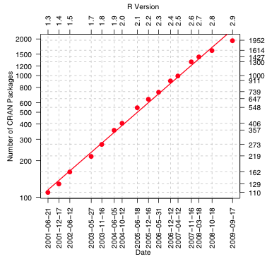
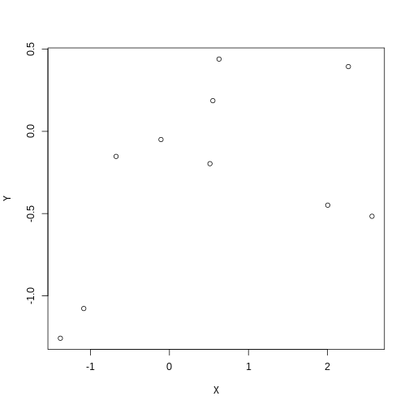
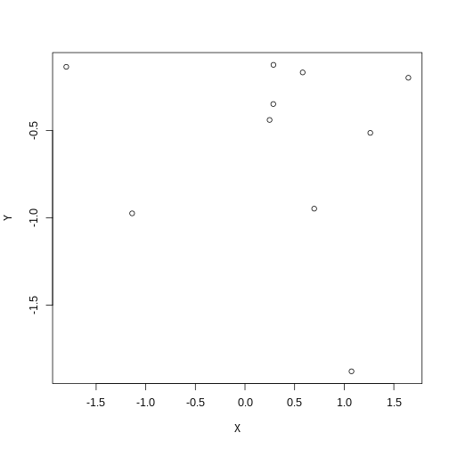
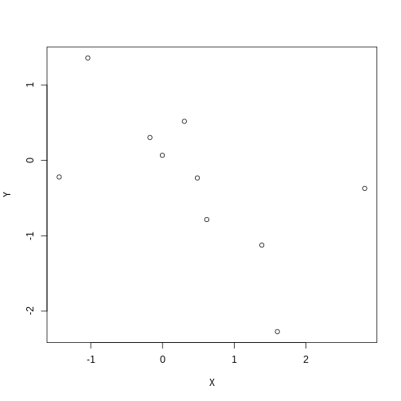
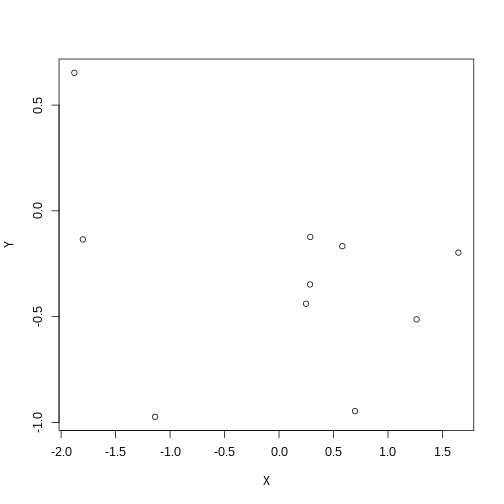
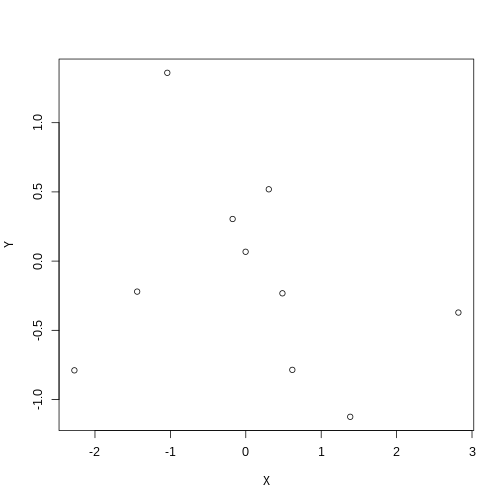
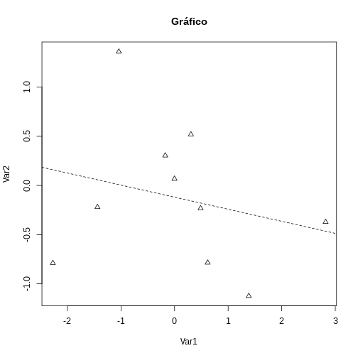

INTRODUCCIÓN AL MANEJO DE DATOS Y PROGRAMACIÓN EN R
========================================================
width: 1366
height: 768
font-family: 'Serif'
author: Gustavo A. Ballen

Museu de Zoologia da Universidade de São Paulo

gaballench@gmail.com


========================================================

# INTRODUCCIÓN A R: BREVE HISTORIA Y CONTEXTO

Acerca de programación/R
========================================================

* "La mayoría de los buenos programadores programan no porque esperan pago por ello o para ser adulados por el público, sino porque es divertido programar." -Linus Torvalds
* "Programar es como conducir un auto, cuando no se sabe lo que se hace, no anda." 
* "Usar `R` sin aprender su gramática es como tratar de identificar carácidos; si no se sabe lo básico, solo vemos una mezcla de cosas desorganizadas con la cual no sabemos por dónde empezar."
* "There are only two kinds of languages: the ones people complain about and the ones nobody uses" -Bjarne Stroustrup

Programación según Bob Ross
=======================================================


La importancia de `R`/ciencia de datos en la vida laboral
=======================================================

Diferentes herramientas informáticas requeridas por empleadores (Fuente: O'Really Strata Survey)

<center></center>

Historia y contexto
=======================================================

* `S` aparece en el año 1988 desarrollado por John Chambers et al. en Bell Labs
* `R` aparece como una versión de libre acceso en el año 1993
* En el año 2001 se encuentran 110 paquetes desarrollados por la comunidad disponibles en CRAN

Historia y contexto
=======================================================


¿Qué es `R`?
=======================================================


¿Qué es `R`?
=======================================================

* Un programa para análisis estadísticos
* Un dialecto de programación
* Una herramienta graficadora
* Una calculadora de escritorio
* Una herramienta de SIG
* Una herramienta de simulación

`R` en comparación con otras herramientas de análisis de datos
=======================================================


`R` en comparación con otras herramientas de análisis de datos
=======================================================


Ventajas de `R`
=======================================================

* Libre acceso
* Corre en cualquier sistema operativo popular
* 6337 paquetes en CRAN (18 de febrero de 2015) y contando...
* Supremamente flexible
* Dialecto de programación
* Enfocado en el análisis estadístico
* Aparte de estadística, tiene un sinnúmero de aplicaciones
* Potente generador de sumarios y gráficas
* Permite la investigación reproducible

Desventajas de `R`
=======================================================

* Curva de aprendizaje relativamente suave
* Todos los objetos deben estar cargados en la memoria RAM
* Temor generalizado al código y a la programación
* Generar gráficas impresionantes requiere experticia
* ¿Realmente soy un usuario que necesita o está interesado en aprender a programar?
* No me despierta en la mañana
* No me prepara el café
* No identifica mis peces o mis fósiles (pero ayuda en ello)

¿En qué sistemas operativos corre `R`?
=======================================================

* MS Windows
* Mac OSX
* Cualquier distribución popular de linux (e.g., Ubuntu, Fedora, Mandriva, Mint, Manjaro, Archlinux...)
* ¡Aún en un PlayStation3!


¿Qué necesito para usar `R`?
=======================================================

* Depende de la cantidad de datos a analizar y de la RAM y procesador disponibles
* Desde una computadora personal para arriba
* No hay una descripción de hardware mínima específica ofrecida por R project
* (opcional) conexión a la internet (al menos para instalar paquetes de manera fácil)

=======================================================
# VARIABLES, OPERADORES, FUNCIONES Y ASIGNACIÓN

Objetos básicos
=======================================================

* Los objetos básicos son vectores, matrices, data frames, arrays, listas y funciones
* Objetos secundarios (o dependientes de funciones) en general son listas con metadatos
* Todo objeto es considerado una variable, pues puede contener "cualquier" valor definido por el usuario

Vectores: Generalidades
=======================================================

* Son arreglos unidimensionales, análogos a los vectores matemáticos. 
* Cada vector contiene una sola clase (e.g., solo elementos de clase `character`)
* Pueden concatenarse en vectores multidimensionales (e.g., un data frame es una colección de vectores)

***


```
[1] 5
```

```
[1] 3.141593
```

```
[1] "a" "b" "c" "d"
```

```
[1] 4+0i
```

```
[1]  TRUE FALSE FALSE  TRUE
```

```
[1] "4"          "0.1"        "TRUE"       "Characidae"
```

Matrices: Generalidades
=======================================================

* Son arreglos bidimensionales
* Deben contener objetos de __la misma__ clase
* Sus dimensiones son líneas * columnas

***


```
     [,1] [,2] [,3]
[1,]    1    4    7
[2,]    2    5    8
[3,]    3    6    9
```

Data frames: Generalidades
=======================================================

* Al igual que las matrices, son arreglos bidimensionales
* Pueden contener columnas con objetos de diferentes clases
* Sus dimensiones son líneas * columnas, las columnas usualmente son las variables. Es sobre las columnas que operan las diferencias de clase

***


```
  var1 var2  var3   var4
1    4    a  TRUE -0.462
2    4    b FALSE  1.423
3    4    c FALSE  0.193
4    4    d  TRUE -0.754
5    4    e FALSE  1.471
```

Arreglos multidimensionales: Generalidades
=======================================================

* Sus dimensiones son mayores a 2
* Su comportamiento es igual al de una matriz de tres o más dimensiones
* Su modificación requiere tener mucho cuidado con las dimensiones a modificar

Arreglos multidimensionales: Generalidades
=======================================================


```r
arr <- array(data = 1:8, dim = c(2, 2, 2))
arr
```

```
, , 1

     [,1] [,2]
[1,]    1    3
[2,]    2    4

, , 2

     [,1] [,2]
[1,]    5    7
[2,]    6    8
```

***


Listas: Generalidades
=======================================================

* Son colecciones de objetos
* Sus componentes pueden ser de cualquier clase
* Sus componentes puede tener cualquier cantidad de dimensiones

***


```
[[1]]
[1] 5

[[2]]
[1] "a" "b" "c" "d"

[[3]]
     [,1] [,2] [,3]
[1,]    1    4    7
[2,]    2    5    8
[3,]    3    6    9
```

```r
class(myList[[1]])
```

```
[1] "numeric"
```

```r
class(myList[[2]])
```

```
[1] "character"
```

```r
class(myList[[3]])
```

```
[1] "matrix"
```

Operadores
=======================================================

* Modifican valores de un objeto
* Agregan valores a un objeto
* Asignan valores a un objeto
* Aritméticos
     + `+`, `-`, `*`, `/`, `^` ó `**` (exponente), `%%` (modulus), `%/%` (división entera)
* Lógicos
     + `<`, `<=`, `>`, `>=`, `==`, `!=`, `!x` (no x), `x|y`(x Ó y), `x&y` (x Y y), `isTRUE(x)` (¿es X verdadero?)
* Asignación
     + `<-` (recomendado), `=` (NO recomendado)

Operadores de asignación
=======================================================

Uso de los operadores de asignación y funciones útiles para generar datos

*  `<-` asigna un valor (o valores) a una variable global (u objeto) (e.g., `variable1  <- valor`). SIEMPRE PARA VALORES!
* `=` asigna un valor (o valores) a una variable local (e.g., argumento x de una función es igual a `TRUE`; más sobre esto después). NUNCA PARA VALORES!
* `<<-` es un asignador que funciona entre ambientes 

Funciones: Generalidades
=======================================================

* Son instrucciones automatizadas que realizan tareas específicas
* Pueden operar sobre objetos, pero no es obligatorio  (e.g., `dir()`)
* Contienen opciones llamadas argumentos
* Sucedidos por paréntesis (e.g., `c()`, `nrow()`, `sd()`, `lm()`)

***


```r
rnorm(3)
```

```
[1]  0.5398719  0.2887610 -0.3314981
```

```r
rep("GAB", 5)
```

```
[1] "GAB" "GAB" "GAB" "GAB" "GAB"
```

Asignando nuestros primeros valores a una variable
=======================================================

* Usar el operador `<-` para asignar el valor `2015` a la variable `x` y la función `c()` para asignar las vocales a la variable `vocales`


```r
x <- 2015
x
```

```
[1] 2015
```

```r
vocales <- c("a", "e", "i", "o", "u")
vocales
```

```
[1] "a" "e" "i" "o" "u"
```

Asignando nuestros primeros valores a una variable: Secuencias
=======================================================

* El operdador `:` genera secuencias de enteros entre `inicio:final` (e.g., `1:7`)
* La función `seq(from, to, by)` genera una secuencia de números entre `from` y `to`, cada `by` unidades (e.g., `from = 1`, `to = 10`, `by = 0.5`) números del 1 al 10 cada 0.5
* La función `seq_along(object)` toma la longitud del objeto, y genera una secuencia de números entre 1 y el número total de elementos en `object`. Útil en for loops.
* La función `seq_len(desired.length)` genera una secuencia entre 1 y el número `desired.length`.

Secuencias
=======================================================


```r
sec <- 11:20
sec
```

```
 [1] 11 12 13 14 15 16 17 18 19 20
```

```r
seq(from = 0, to = 10, by = 2)
```

```
[1]  0  2  4  6  8 10
```

```r
seq_along(sec)
```

```
 [1]  1  2  3  4  5  6  7  8  9 10
```

```r
seq_len(20)
```

```
 [1]  1  2  3  4  5  6  7  8  9 10 11 12 13 14 15 16 17 18 19 20
```

Modificación matemática de un vector
=======================================================

* Se pueden modificar todos los valores de un vector a la vez tal como operan los escalares en vectores matemáticos


```r
k <- 3
V <- c(1, 2, 3, 4, 5)
k*V # xV = {kV1, kV2, kV3, kV4, kV5} = 3*1, 3*2, ..., 3*5
```

```
[1]  3  6  9 12 15
```

* El ejemplo de arriba usó la multiplicación, pero se puede realizar cualquier operación matemática con este mismo principio.

Agregando valores de un vector: c()
=======================================================

* `c()` `c`oncatena valores a un vector
* `c(vector, valores_a_agregar)`

```r
A <- 45
A <- c(A, 23)
A
```

```
[1] 45 23
```

Modificando los valores de un arreglo: cbind
=======================================================

Modificando los valores de un arreglo: rbind
=======================================================

Limpiando el espacio de trabajo: rm()
=======================================================


* rm()


```r
rm(A)
```

Qué tenemos en el espacio de trabajo?: ls()
=======================================================

* ls()

```r
ls()
```

```
[1] "arr"     "df"      "k"       "matrix"  "myList"  "sec"     "V"      
[8] "vocales" "x"      
```

Muestreo aleatorio
=======================================================

* sample()


```r
sample(vocales, 3)
```

```
[1] "u" "i" "e"
```


* which()


```r
which(vocales =="e")
```

```
[1] 2
```

Algunas funciones de uso frecuente
=======================================================

* class()


```r
class(df)
```

```
[1] "data.frame"
```

* length()


```r
length(myList)
```

```
[1] 3
```

=======================================================
# APENDICE: COERCIÓN

Qué es coerción?
=======================================================

* Conversión entre clases atómicas (e.g., entre `character` y `factor`, entre `numeric` e `integer`, etc.)
* El objetivo es preservar el símbolo/contenido, pero permitir otro tipo de operaciones con el cambio de clase
* Existen dos tipos: Implícita y explícita. La primera, declarada por el usuario, la segunda, llevaga a cabo por el sistema

Coerción explícita
=======================================================

* Se logra por medio de las funciones `as.CLASS()`, siendo CLASS cualquiera de las clases atómicas ya conocidas.
* Generalmente útil cuando los métodos aplicados a objetos solo soportan alguna clase particular, pero pueden operar sobre los mismos símbolos.
* El símbolo NO necesariamente lleva una clase explícita. Por ejempĺo, el número `1` puede ser de cualquier clase, aún `logical`:

Coerción explícita: Entre `numeric` e `integer`
=======================================================


```r
float <- 5
print(float)
```

```
[1] 5
```

```r
class(float) # Qué clase tiene el objeto float?
```

```
[1] "numeric"
```

***


```r
integer <- as.integer(float) # Coerción de clase numeric a integer
print(integer)
```

```
[1] 5
```

```r
class(integer) # Qué clase tiene el objeto integer?
```

```
[1] "integer"
```

Coerción explícita: Entre `character` y `factor`
=======================================================


```r
string <- c("a", "b", "b", "b", "a", "c", "d", "c", "a", "e")
print(string)
```

```
 [1] "a" "b" "b" "b" "a" "c" "d" "c" "a" "e"
```

```r
class(string)
```

```
[1] "character"
```

***


```r
fact <- as.factor(string)
print(fact)
```

```
 [1] a b b b a c d c a e
Levels: a b c d e
```

```r
class(fact)
```

```
[1] "factor"
```

Coerción explícita: En general...
=======================================================

Cuando tiene sentido...

```r
numeros <- 0:3
as.numeric(numeros)
```

```
[1] 0 1 2 3
```

```r
as.logical(numeros)
```

```
[1] FALSE  TRUE  TRUE  TRUE
```

```r
as.character(numeros)
```

```
[1] "0" "1" "2" "3"
```

***

Cuando no tiene sentido...

```r
letras <- c('a', 'b', 'c')
as.numeric(letras)
```

```
[1] NA NA NA
```

```r
as.logical(letras)
```

```
[1] NA NA NA
```

```r
as.complex(letras)
```

```
[1] NA NA NA
```

=======================================================
# PAQUETERÍA Y POTENCIAL GRÁFICO

¿Qué son los paquetes?
=======================================================

* Software (i.e., funciones) escritas para llevar a cabo tareas relacionadas
* TODOS de libre acceso
* La mayoría escritos en R, pero varios en C, C++ o FORTRAN
* Nivel pro en R. Si se ha aprendido a programar y se han generado funciones útiles para alguna tarea que valga la pena publicar, tal vez sea buena idea someter un nuevo paquete. La inmensa mayoría de los usuarios jamás llega a este punto

¿Qué son los paquetes?
=======================================================

* R + 4 paquetes

* R + 6 paquetes


***

* R + 12 paquetes

* R + N paquetes


¿Dónde se encuentran?
=======================================================

* En el "Comprehensive R Archive Network", el repositorio oficial de R (http://cran.r-project.org/)
* R ha evolucionado de manera increíble en cuanto a soporte adicional de paquetería.



Ejemplos de paquetes
=======================================================

* `ggplot2`. Sistema avanzado de graficación
* `vegan`. Paquete para análisis ecológicos
* `ddplyr`. Paquete de herramientas para manipulación de datos
* `xlsx`. Paquete para importar/exportar datos entre R y MS Excel

Instalación
=======================================================

* install.packages()


```r
install.packages("vegan") #El nombre del paquete va entre comillas
```

Cargando paquetes
=======================================================

* library()


```r
library(vegan) #Al cargar el paquete NO usar comillas
```

* Los paquetes pueden tener dependencias, es decir, requerir paquetes adicionales para funcionar. Siempre descargar e instalar el paquete Y sus dependencias
* Una vez cargado el paquete, se puede hacer uso de sus funciones
* En este ejemplo, la función `specaccum()` del paquete `vegan`, solo funcionará después de cargar el paquete

Gráficos en `R`
=======================================================

* R tiene opciones extensas de graficación, desde sistemas sencillos como `base` a algunos más sofisticados como `lattice` o `ggplot2`
* Cada sistema de gráficos de `R` tiene sus pros y sus contras, y trabaja mejor bajo condiciones específicas
* La graficación en `R` es un arte complejo y requiere mucho esfuerzo para ser dominado. Cada tipo de gráfica puede requerir un sistema gráfico diferente

Gráficos en `R`
=======================================================

* Hay dos pasos básicos que son más evidentes en `base`: Generación del gráfico y anotación. EL sistema `lattice` es diferente pues el gráfico se genera con una sola llamada de función. 
* En contraste, `ggplot2` es un sistema que funciona con ambos procedimientos, generación de gráficos y anotación, pero también puede generar un gráfico completo con una sola llamada de función como `lattice`.

Gráficos en R: `base`
=======================================================


```r
plot(Y ~ X, data = datos) # Gráfico básico
```

 

***


```r
par(lty = 2, pch = 2)
plot(Y ~ X, data = datos, main = "Gráfico", xlab = "Var1", ylab = "Var2")
abline(lmod)
```

 

Gráficos en R: `lattice`
=======================================================


```r
library(lattice)
cloud(mpg~wt*qsec|cyl.f, main="3D Scatterplot by Cylinders")
```

 

Gráficos en R: `ggplot2`
=======================================================


```r
library(ggplot2)
attach(mtcars)
qplot(wt, mpg, data=mtcars, geom=c("point", "smooth"), method="lm", formula=y~x, color=cyl, main="Regression of MPG on Weight", xlab="Weight", ylab="Miles per Gallon")
```

 

```r
detach(mtcars)
```

Gráficos en R: `ggplot2`
=======================================================

```r
# Creación del objeto que alojará las capas del gráfico
p <- qplot(hp, mpg, data=mtcars, shape=am, color=am, facets=gear~cyl, main="Scatterplots of MPG vs. Horsepower", xlab="Horsepower", ylab="Miles per Gallon")

# Adición de fondo blanco y líneas de separación negras
p + theme_bw()

# Cambios en el color y el tamanho de los rótulos, adición de leyenda
p + theme(axis.title=element_text(face="bold.italic",
   size="12", color="brown"), legend.position="top") 
```

Gráficos básicos: Histograma
=======================================================

 


Gráficos básicos: Boxplot
=======================================================

 

Gráficos básicos: Diagrama de barras
=======================================================

 

Gráficos básicos: Diagrama de dispersión + Regresión
=======================================================

 

Gráficos básicos: Gráficos de densidad (Distribuciones)
=======================================================

 

Gráficos básicos: Dendrogramas
=======================================================

 


Gráficos básicos: Heatmaps
=======================================================

 
