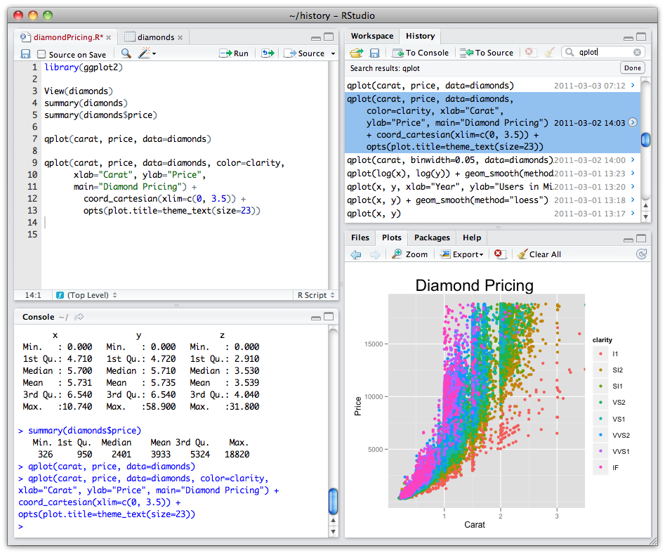
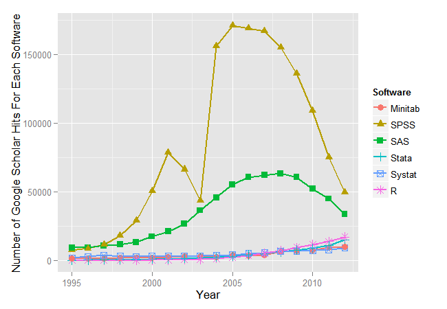

INTRODUCCIÓN AL MANEJO DE DATOS Y PROGRAMACIÓN EN R
========================================================
font-family: 'Serif'
author: Gustavo A. Ballen
Museu de Zoologia da Universidade de São Paulo
gaballench@gmail.com


========================================================

# INTRODUCCIÓN A R: BREVE HISTORIA Y CONTEXTO

Acerca de programación/R
========================================================

* "La mayoría de los buenos programadores programan no porque esperan pago por ello o para ser adulados por el público, sino porque es divertido programar." -Linus Torvalds
* "Programar es como conducir un auto, cuando no se sabe lo que se hace, no anda." 
* "Usar `R` sin aprender su gramática es como tratar de identificar carácidos; si no se sabe lo básico, solo vemos una mezcla de cosas desorganizadas con la cual no sabemos por dónde empezar."

Programación según Bob Ross
=======================================================


La importancia de `R`/ciencia de datos en la vida laboral
=======================================================

Diferentes herramientas informáticas requeridas por empleadores (Fuente: O'Really Strata Survey)


Historia y contexto
=======================================================

* `S` aparece en el año 1988 desarrollado por John Chambers et al. en Bell Labs
* `R` aparece como una versión de libre acceso en el año 1993
* En el año 2001 se encuentran 110 paquetes desarrollados por la comunidad disponibles en CRAN

Historia y contexto
=======================================================


¿Qué es `R`?
=======================================================



¿Qué es `R`?
=======================================================

* Un programa para análisis estadísticos
* Un dialecto de programación
* Una herramienta graficadora
* Una calculadora de escritorio
* Una herramienta de SIG
* Una herramienta de simulación

`R` en comparación con otras herramientas de análisis de datos
=======================================================


`R` en comparación con otras herramientas de análisis de datos
=======================================================



Ventajas de `R`
=======================================================

* Libre acceso
* Corre en cualquier sistema operativo popular
* 6337 paquetes en CRAN (18 de febrero de 2015) y contando...
* Supremamente flexible
* Dialecto de programación
* Enfocado en el análisis estadístico
* Aparte de estadística, tiene un sinnúmero de aplicaciones
* Potente generador de sumarios y gráficas
* Permite la investigación reproducible

Desventajas de `R`
=======================================================

* Curva de aprendizaje relativamente suave
* Todos los objetos deben estar cargados en la memoria RAM
* Temor generalizado al código y a la programación
* Generar gráficas impresionantes requiere experticia
* ¿Realmente soy un usuario que necesita o está interesado en aprender a programar?
* No me despierta en la mañana
* No me prepara el café
* No identifica mis peces o mis fósiles (pero ayuda en ello)

¿En qué sistemas operativos corre `R`?
=======================================================

* MS Windows
* Mac OSX
* Cualquier distribución popular de linux (e.g., Ubuntu, Fedora, Mandriva, Cinnamon, Manjaro, Archlinux...)
* ¡Aún en un PlayStation3!


¿Qué necesito para usar `R`?
=======================================================

* Depende de la cantidad de datos a analizar y de la RAM y procesador disponibles
* Desde una computadora personal para arriba
* No hay una descripción de hardware mínima específica ofrecida por R project
* (opcional) conexión a la internet (al menos para instalar paquetes de manera fácil)

=======================================================
# VARIABLES, OPERADORES, FUNCIONES Y ASIGNACIÓN

Objetos básicos
=======================================================

* Los objetos básicos son vectores, matrices, data frames, listas y funciones
* Objetos secundarios (o dependientes de funciones) en general son listas con metadatos
* Todo objeto es considerado una variable, pues puede contener "cualquier" valor definido por el usuario

Vectores
=======================================================

* Son arreglos unidimensionales, análogos a los vectores matemáticos. 
* Pueden contener diferentes clases de valores, pero solo una por vector (e.g., todos `character`)
* Pueden concatenarse en vectores multidimensionales (e.g., un data frame es una colección de vectores)

***


```
[1] 5
```

```
[1] 3.141593
```

```
[1] "a" "b" "c" "d"
```

```
[1] 4+0i
```

```
[1]  TRUE FALSE FALSE  TRUE
```

```
[1] "4"          "0.1"        "TRUE"       "Characidae"
```

Matrices
=======================================================

* Son arreglos bidimensionales
* Deben contener objetos de __la misma__ clase
* Sus dimensiones son líneas * columnas

***


```
     [,1] [,2] [,3]
[1,]    1    4    7
[2,]    2    5    8
[3,]    3    6    9
```

Data frames
=======================================================

* Al igual que las matrices, son arreglos bidimensionales
* Pueden contener columnas con objetos de diferentes clases
* Sus dimensiones son líneas * columnas, las columnas usualmente son las variables. Es sobre las columnas que operan las diferencias de clase

***


```
  var1 var2  var3   var4
1    4    a  TRUE -0.307
2    4    b FALSE  1.019
3    4    c FALSE -0.523
4    4    d  TRUE  1.026
5    4    e FALSE  1.511
```

Listas
=======================================================

* Son colecciones de objetos
* Sus componentes pueden ser de cualquier clase
* Sus componentes puede tener cualquier cantidad de dimensiones

***


```
[[1]]
[1] 5

[[2]]
[1] "a" "b" "c" "d"

[[3]]
     [,1] [,2] [,3]
[1,]    1    4    7
[2,]    2    5    8
[3,]    3    6    9
```

Operadores
=======================================================

* Modifican valores de un objeto
* Agregan valores a un objeto
* Asignan valores a un objeto
* Aritméticos
     + `+`, `-`, `*`, `/`, `^` ó `**` (exponente), `%%` (modulus), `%/%` (división entera)
* Lógicos
     + `<`, `<=`, `>`, `>=`, `==`, `!=`, `!x` (no x), `x|y`(x Ó y), `x&y` (x Y y), `isTRUE(x)` (¿es X verdadero?)
* Asignación
     + `<-` (recomendado), `=` (NO recomendado)

Operadores de asignación
=======================================================

Uso de los operadores de asignación y funciones útiles para generar datos

*  `<-` asigna un valor (o valores) a una variable global (u objeto) (e.g., `variable1  <- valor`). SIEMPRE PARA VALORES!
* `=` asigna un valor (o valores) a una variable local (e.g., argumento x de una función es igual a `TRUE`; más sobre esto después). NUNCA PARA VALORES!
* c() junta los valores separados entre sí por comas (e.g., `c(elemento1, elemento2, elemento3, ...,  elementoN)`)
* `:` genera series de números enteros (e.g., `primer:último`; 1:10 son los enteros del 1 al 10)

Operadores
=======================================================

* `cbind()` une vectores como columnas en un arreglo de tipo `matrix` o `data frame`
* `rbind()` une vectores como filas en un arreglo de tipo `matrix` o `data frame`
* Solo una condición: Los vectores a unir DEBEN ser de la misma longitud

Funciones (generalidades)
=======================================================

* Son instrucciones automatizadas que realizan tareas específicas
* Pueden operar sobre objetos, pero no es obligatorio  (e.g., `dir()`)
* Contienen opciones llamadas argumentos
* Sucedidos por paréntesis (e.g., `c()`, `nrow()`, `sd()`, `lm()`)

***


```r
rnorm(3)
```

```
[1] -1.60399061  1.68000318 -0.01831694
```

```r
rep("GAB", 5)
```

```
[1] "GAB" "GAB" "GAB" "GAB" "GAB"
```

Asignando nuestros primeros valores a una variable
=======================================================

* Usar el operador `<-` para asignar el valor `2015` a la variable `x` y la función `c()` para asignar las vocales a la variable `vocales`


```r
x <- 2015
x
```

```
[1] 2015
```

```r
vocales <- c("a", "e", "i", "o", "u")
vocales
```

```
[1] "a" "e" "i" "o" "u"
```

Algunas funciones de uso frecuente
=======================================================

* c()

```r
A <- 45
A <- c(A, 23)
A
```

```
[1] 45 23
```


* ls()

```r
ls()
```

```
[1] "A"       "df"      "matrix"  "myList"  "vocales" "x"      
```

Algunas funciones de uso frecuente
=======================================================

* rm()

```r
rm(A)
```

* cbind(), rbind()

```r
df <- cbind(df, var5 = 1:5)
df
```

```
  var1 var2  var3   var4 var5
1    4    a  TRUE -0.307    1
2    4    b FALSE  1.019    2
3    4    c FALSE -0.523    3
4    4    d  TRUE  1.026    4
5    4    e FALSE  1.511    5
```

Algunas funciones de uso frecuente
=======================================================

* sample()


```r
sample(vocales, 3)
```

```
[1] "a" "e" "o"
```

* which()


```
processing file: Session1.Rpres
Quitting from lines 298-299 (Session1.Rpres) 
Erro em get(sprintf(".%s", hash), envir = knit_global(), mode = mode,  : 
  objeto '.Session1-cache/unnamed-chunk-13_5584a8aa47aae42b25f481338ec35d5a' de modo 'character'  não foi encontrado
```
