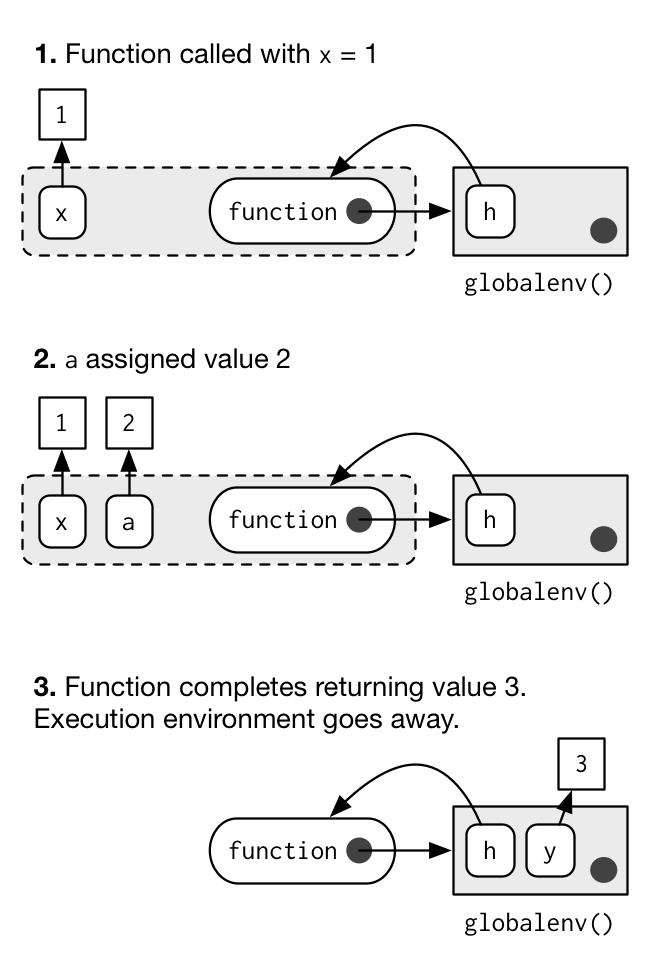

INTRODUCCIÓN AL MANEJO DE DATOS Y PROGRAMACIÓN EN R
========================================================
width: 1366
height: 768
font-family: 'Serif'
author: Gustavo A. Ballen

Museu de Zoologia da Universidade de São Paulo

gaballench@gmail.com

=======================================================
# FUNCIONES, ESTRUCTURAS DE CONTROL, E INTRODUCCIÓN A LA SIMULACIÓN

=======================================================
# FUNCIONES

Funciones (programación)
=======================================================
* Si hay una tarea de debemos repetir, tal vez sea buena idea crear una función que automatice dicha tarea
* Presentan cuatro componentes: nombre, formales (argumentos), cuerpo y ambiente
* Formales son objetos que permiten controlar el comportamiento de la función
* Son objetos creados a través de la función `function` y el operador de asignación `<-` (e.g. `xfun <- function(...) {body}`)

Nombre
=======================================================

* Como todo otro objeto en R, las functiones tienen nombre
* Esto es una consecuencia de que en R las funciones son "ciudadanos de primera clase". Esto implica que son objetos con nombre, valor, y que pueden ser pasados como valores de formales en otras funciones (e.g., `rm(list = sl())`).

Formales
=======================================================

* Los formales o argumentos de una función son objetos que modifican el comportamiento de la función. Puede pensarse en estos como opciones de la función.
* Ellos se encuentran en la región entre paréntesis de la llamada de una función.
* Una forma de reconocer visualmente los fomales de una función es porque sus valores son asignados con `=`
* La manera apropiada de obtener los formales de una función es usando la función `formals(nombre-de-la-función)` (e.g., `formals(mean)`)
* Por ejemplo en `lm(formula = y ~ x, data = datset)` los formales de esa llamada de función son `formula` y `data` (visualmente)
* Los formales totales de `lm` se encuentran con `formals(lm)`

Cuerpo
=======================================================

* El cuerpo de la función es el código que, escrito en ellas, es ejecutado cuando llamamos dicha función
* Puede ser obtenido usando la función `body(nombre-de-la-función)`
* En ocasiones ese código no es visible por medio de dicha función cuando el código no está escrito en R sino en C, C++ o FORTRAN

Ambientes
=======================================================

* Ambiente (versión corta): Estructura que asocia un nombre con sus valores en un objeto
* Puede pensarse como la caja de la memoria en uso donde residen los valores del la función (e.g., cuerpo) y que asocia el nombre de la misma con su contenido
* Cada función tiene su propio ambiente
* La mayor parte del tiempo no tendremos que preocuparnos por el ambiente de la función, pero conforme aumente nuestro dominio de R nos permitirá realizar operaciones más complejas

Qué sucede internamente al llamar una función?
=======================================================

<center></center>

Fuente: http://adv-r.had.co.nz/diagrams/environments.png/execution.png

Creando nuestra primera función
=======================================================

* Supongamos que necesitamos realizar una operación muchísimas veces y somos muy perezosos. Esta operación consiste en tomar un vector numérico, multiplicarlo por 10 y a ese resultado convertirlo en "character"
* la sintaxis `name <- function(formals) {body}` es todo lo que necesitamos
* Debemos definir cómo la llamaremos, qué argumentos va a tener, y qué va a hacer dicha función


```r
diez_caracter <- function(objeto) { # nombre es diez_caracter, argumento objeto
        resultado = objeto * 10 # tomar objeto y multiplicarlo por 10
        resultado = as.character(resultado) # convertir ese resultado en character
        print(resultado) # imprimir en pantalla ese resultado
} # cierra función
a <- 10; diez_caracter(a)
```

```
[1] "100"
```


Ejemplo trivial: Función sin argumentos
=======================================================


```r
borrar <- function() { # creamos una función borrar
        rm() # esta función llama a la función rm() sin argumentos
}

repetir <- function() {
        val <- 2 * 2 * 2 * 2
        val
}

repetir()
```

```
[1] 16
```

```r
repetir()
```

```
[1] 16
```


Ejemplo no trivial: Función sin argumentos
=======================================================


```r
apeChecker <- function() {
        apePath <- try(find.package("ape"), silent = TRUE)
	if(class(apePath) != "character") {
		installPack <- readline(prompt = "Package \'ape\' is not installed, do you want to install it now? (press only \'y\' or \'n\') and ENTER: ")
		if(installPack %in% c("y", "Y")) {
			install.packages("ape")
		} else {
			stop("You need \'ape\' installed in order to use the script.")
		}
	}
        return("Package \'ape\' installed. Nothing to do")
}
apeChecker()
```

```
[1] "Package 'ape' installed. Nothing to do"
```

=======================================================
# ESTRUCTURAS DE CONTROL

Qué son las estructuras de control?
=======================================================

* Son elementos del leguaje que dan instrucciones específicas a la computadora
* Pueden tomar decisiones (if-else, while), repetir operaciones (for), y romper rutinas (break)
* Las estructuras de control son comunes a muchísimos lenguajes de programación, y algunas como if-else y for son ubicuas y tienen el mismo significado
* Son junto con las funciones el núcleo de la programación en R
* Pueden anidarse para llevar a cabo tareas complejas donde el script puede "tomar decisiones" y realizar ciclos iterativos dentro de ciclos iterativos

If, else
=======================================================

* Su significado es literal. If (en español, si) es un condicional que opera bajo eventos lógicos
* Sintaxis: `if(condicion(es) lógica(s)) {hacer algo}`
* Si las condiciones no se cumplen, salta las actividades entre `{}`
* Else, también tiene un significado literal. Else (en español, de otro modo) se lleva a cabo si las condiciones en if(condiciones) no se cumplen
* La estructura de una llamada if-else completa podría ser:

```r
if(a > 10) { # a > 10 dará un resultado lógico (TRUE o FALSE)
        print("A es mayor que diez") # La operación a realizar si a > 10
} else { # Si A no es > 10...
        print("A no es mayor que diez") # Hacer otra cosa cuando a =< 10
}
```

Simplificaciones de la sintaxis if-else
=======================================================

* R tiene muchas maneras de hacer funcionar una sentencia if-else
* Lo mínimo necesario para llevarla a cabo es `if(condición) tareas`
* A lo anterior se suma que una estructura if-else puede aún escribirse en una sola línea, y omitir los corchetes
* Esta propiedad de R puede ser un arma de doble filo: Por un lado brinda flexibilidad sintáctica, pero por otro lado puede introducir confusión o aún generar errores cuando no se usa con cuidado
* La guia de estilo de google indica que lo mejor es usar corchetes, y que el cuerpo de la sentencia vaya en nueva línea (sintaxis no simplificada)


```r
if(a > 10) {print("A es mayor que diez")} else {print("A no es mayor que diez")}
if(a > 10) {print("A es mayor que diez")}
if(a > 10) print("A es mayor que diez")
```

For
=======================================================

* La estructura for (a.k.a. for loop, o bucle for) repite una tarea un numero _determinado_ de veces
* Dentro de un for loop se pueden incluir varias tareas secuenciales, las cuales son llevadas a cabo en cada iteración del loop
* Cada iteración puede incluir otras estructuras de control anidadas, aún otros for loops
* El número de iteraciones dependerá del argumento indicado en la secuencia de elementos
* Su sintaxis básica es `for(elemento in secuencia-de-elementos) {tareas en cada iteración}`

For
=======================================================


```r
for(i in 1:10) { # i = elemento; 1:10 secuencia del 1 al 10
        x = i * 10 # primera línea del cuerpo del loop, multiplique el elemento por 10
        print(x) # segunda línea del cuerpo, imprima el valor de x creado arriba
}
```

```
[1] 10
[1] 20
[1] 30
[1] 40
[1] 50
[1] 60
[1] 70
[1] 80
[1] 90
[1] 100
```

Simplificaciones de for y errores comunes
=======================================================

* La sintaxis de for puede reducirse de un modo similar al caso de if-else: `for(i in elements) do-something`
* Algunos errores comunes son declarar un número en el loop, no un conjunto de objetos y otros casos donde no se generan secuencias o no se declaran adecuadamente los elementos de un vector
* Uso inadecuado de funciones generadoras de secuencias
* Interpretación erronea del significado de `i`. Esta es una variable de iteración, que toma el valor correspondiente a cada una de ellas, es decir, en la primera iteración i = 1, en la segunda i = 2 ... i = ultimo-elemento-seq

Errores comunes en for
=======================================================


```r
# El objetivo es imprimir cada uno de los elementos 1 a 100

for(i in 10) {print(i)} # 10 es UN elemento, no un conjunto de elementos

for(1:10) {print(i)} # está faltando la variable de iteración

for(i in 1:10) {print(x)} # está imprimiendo todo x porque no indicamos que debía ser el i-ésimo elemento de x. Debe corregirse por print(x[i])

x <- 1:10 # aún teniendo 10 elementos, length(x) tiene a su vez longitud 1
for(i in seq_len(x)) {print(x[i])} # erróneo porque seq_len(x) va a tomar el primer elemento de x como el argumento length.out, que va a dar 1

for(i in seq(x)) {print(x[i])} # correcto, pero por razones de claridad es mejor usar seq_along(x)

for(i in x) {print(x[i])} # correcto, R implicitamente genera una secuencia de enteros con longitud igual al elemento x. No se recomienda para principiantes pues puede llevar a una concepción errada de cuántas veces se iterará
```

Errores comunes en for
=======================================================

* Hay que recordar que for(i in seq) significa para cada i en la secuencia de enteros seq, no literalmente para cada _elemento_ de seq


```r
y <- c(2, 4, 6)
seq_along(y)
```

```
[1] 1 2 3
```

```r
for(i in seq_along(y)) {print(i)}
```

```
[1] 1
[1] 2
[1] 3
```

***


```r
w <- 1:3
seq_along(w)
```

```
[1] 1 2 3
```

```r
for(i in seq_along(w)) {print(i)}
```

```
[1] 1
[1] 2
[1] 3
```

```r
for(i in seq_along(y)) {print(y[i])}
```

```
[1] 2
[1] 4
[1] 6
```

While
=======================================================

* Funciona de una manera similar a un for loop, pero no tiene un número finito de iteraciones _a priori_. Tiene el potencial de generar loops infinitos
* Es una estructura intermedia entre if y for, pues es iterativa pero controlada por expresiones lógicas
* Su control interno proviene de una condición lógica como en if-else, no de una secuencia como en for
* Debe usarse con cuidado. La mayor parte de las veces es posible reescribir un while loop como un for loop
* Si es definitivamente necesario usarlo, debe incluirse una estructura de control que permita quebrar el loop bajo condiciones específicas
* Útil en simulación, o cuando no se sabe a priori cuántas iteraciones debe realizar la estructura de control
* Sintaxis `while(condición) {tareas}`

Ejemplo controlado de while
=======================================================


```r
control <- 5 # valor de control
s <- 1 # valor de inicio para s
v <- vector() # cree un vector para alojar valores
while(s <= control) { # condición: el valor de s menor o igual a control
        print(s) # imprima el valor actual de s
        v <- c(v, s) # además, tome cada valor de s y peguelo al vector v
        s <- s + 1 # actualice el valor de s cada iteración sumándole 1
}
```

```
[1] 1
[1] 2
[1] 3
[1] 4
[1] 5
```

```r
v # v va a tener todos los valores que fueron incorporados en el while loop
```

```
[1] 1 2 3 4 5
```

Loop infinito (NO CORRER!!!)
=======================================================


```r
s <- 1 # valor de inicio para s
v <- vector() # cree un vector para alojar valores
while(s > 0) { # condición: el valor de s es mayor a cero
        print(s) # imprima el valor actual de s
        v <- c(v, s) # además, tome cada valor de s y peguelo al vector v
        s <- s + 1 # actualice el valor de s cada iteración sumándole 1
}
v # v va a tener todos los valores que fueron incorporados en el while loop
```

* Esta iteración correrá para siempre pues s desde el principio es mayor a 0 (i.e., su valor inicial es 1) y las lineas 2 y 3 del cuerpo solamente hacen aumentar el valor de s, de modo que la condición siempre dará `TRUE`

Repeat
=======================================================

* Más similar a un for loop que a una estructura while, pues no presenta una manera de controlar la cantidad de iteraciones que se llevará a cabo
* Tiene un potencial gigante para generar loops infinitos
* El control de dicha estructura debe venir de condiciones externas al mismo, de un modo similar a while pero con frecuencia ayudado de una estructura if-else
* Su aplicación viene a ser usualmente dentro de estructuras de control anidadas
* Por Alá en los cielos, usar solo en casos en los cuales ni un for, ni un while funcionarían 

Repeat controlado por if-else
=======================================================


```r
control <- 5 # valor de control
s <- 1 # valor de inicio para s

repeat { # condición: el valor de s menor o igual a control
        if(s <= control) { # la estructura if-else controla la cantidad de iteraciones
                print(s) # imprima el valor actual de s
                s <- s + 1 # actualice el valor de s cada iteración sumándole 1
        } else {
                break # esta estructura rompe el loop. Más sobre esto después
        }
}
```

```
[1] 1
[1] 2
[1] 3
[1] 4
[1] 5
```

Repeat en loop infinito (NO CORRER!!!)
=======================================================

* En este repeat loop la expresión `print("perdeu playboy!")` será impresa en la consola _ad infinitum_. Por curiosidad, esa expresión es muy usada por los rateros en Rio de Janeiro, y a la usanza colombiana sería lo mismo que "ya perdió ñero"


```r
repeat {
        print("perdeu playboy!")
}
[1] "perdeu playboy!"
[1] "perdeu playboy!"
[1] "perdeu playboy!"
[1] "perdeu playboy!"
[1] "perdeu playboy!"
[1] "perdeu playboy!"
... ad infinitum
```

Cómo romper iteraciones? Break y Next
=======================================================

* Estas estructuras de control sirven para parar del todo un loop (finito o infinito) o para saltar la iteración actual a la siguiente
* Su utilidad viene al acoplarlas con estructuras if-else anidadas dentro de una iteración for, while o repeat

Break
=======================================================


```r
control <- 5 # valor de control
s <- 1 # valor de inicio para s

repeat {
        if(s <= control) {
                print(s)
                s <- s + 1
        } else {
                break # esta estructura rompe el loop si if no se cumple
        }
}
```

```
[1] 1
[1] 2
[1] 3
[1] 4
[1] 5
```

Next
=======================================================


```r
s <- 1:10 # valor de inicio para s

for(i in seq_along(s)) {
        
        if(s[i] < 4 | s[i] > 6) {
                print(s[i])
        } else {
                next # esta estructura rompe el loop si if no se cumple
        }
}
```

```
[1] 1
[1] 2
[1] 3
[1] 7
[1] 8
[1] 9
[1] 10
```


=======================================================
# SIMULACIÓN


Aspectos básicos
=======================================================

* Las simulaciones tienen muchas aplicaciones en ciencia, desde responder a preguntas de tipo "y qué tal si..." hasta experimentar con el comportamiento de distribuciones o de procedimientos
* Una aplicación importante de las simulaciones es el estudio de sistemas para los cuales no es posible -o resulta costoso- tomar datos reales
* Una buena parte de estimación estadística está basada en simulaciones (e.g., procesos Monte Carlo, estimación de parámetros, TLC)
* Básicamente hay dos aspectos importantes a tener en cuenta. El primero, las simulaciones suelen estudiar muestras para encontrar poblaciones, y el segundo, las iteraciones son muy importantes para repetir procedimientos un numero adecuado de veces
* Se pueden usar para modelado de sistemas

Herramientas de simulación
=======================================================

* Datos aleatorios (funciones `rDIST()`)
* Muestreo (`sample()`)
* Iteraciones (`for`, `while`, `repeat`)
* Replicabilidad de las simulaciones (`set.seed()`)

Replicabilidad
=======================================================

* Cuando estudiamos valores aleatorios provenientes de una población de datos o de una distribución de probabilidad enfretamos el problema de que cada vez que corremos el código se generarán datos diferentes a los iniciales. Es decir, nuestros valores aleatorios siempre van a cambiar
* Cómo saber si el comportamiento de nuestras simulaciones se debe a diferencias en el proceso de simular, o simplemente a que los datos están cambiando?
* set.seed() es una función que permite obtener números aleatorios pero recordar su órden de aparición, de tal suerte que siempre que corramos el script obtendremos los mismos números aleatorios

Cómo genera R números aleatorios?
=======================================================

* La computación es un proceso deterministico, por lo que la aleatorización sensu stricto no es un proceso tan sencillo de llevar a cabo
* La mayoría de veces, cuando una persona habla de números aleatorios realmente se refiere a algoritmos que generan de manera deterministica dos clases de estos: Pseudo-aleatorios y cuasi-aleatorios. Los primeros quieren parecer aleatorios, los segundos aceptan que son determinísticos pero equidistribuídos
* R hace uso de varios algoritmos de generación de números aleatorios, siendo Mersenne-Twister aquel usado por defecto 
* Para mayor información ver [Dunag & Wuertz](http://cran.r-project.org/web/packages/randtoolbox/vignettes/fullpres.pdf)


set.seed()
=======================================================


```r
set.seed(1985) # cualquier número de nuestra elección
rnorm(5)
```

```
[1]  0.4229517 -1.1130375 -0.3159614  0.1427768  1.2473865
```

```r
set.seed(1985) # cualquier número de nuestra elección
rnorm(5)
```

```
[1]  0.4229517 -1.1130375 -0.3159614  0.1427768  1.2473865
```

***


```r
rnorm(5)
```

```
[1] -0.5250023  0.7965084  1.2365271 -1.2740633 -0.4924191
```

```r
rnorm(5)
```

```
[1]  0.5789328 -3.1886400  0.4839632 -1.4181733  1.3528800
```

```r
set.seed(1985)
rnorm(5)
```

```
[1]  0.4229517 -1.1130375 -0.3159614  0.1427768  1.2473865
```


=======================================================


=======================================================


=======================================================


=======================================================


=======================================================


=======================================================


=======================================================


=======================================================


=======================================================


=======================================================


=======================================================


=======================================================


=======================================================


=======================================================
